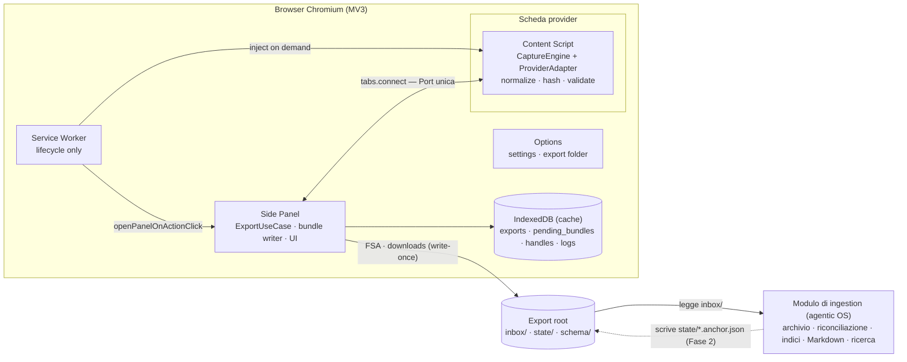
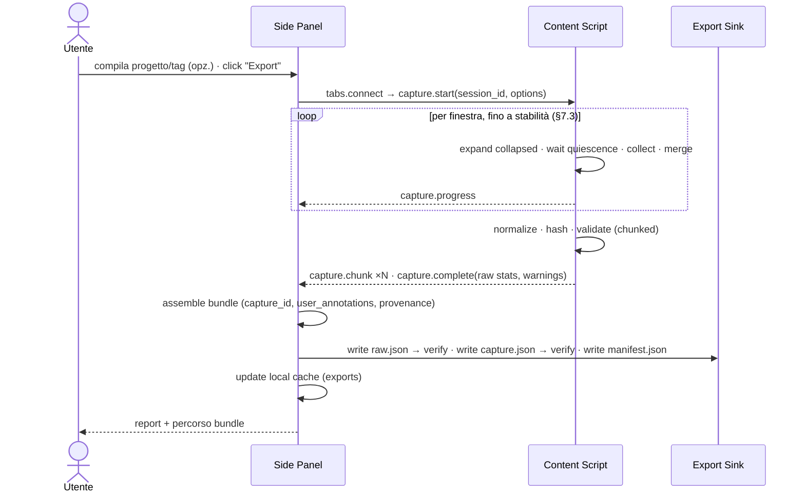
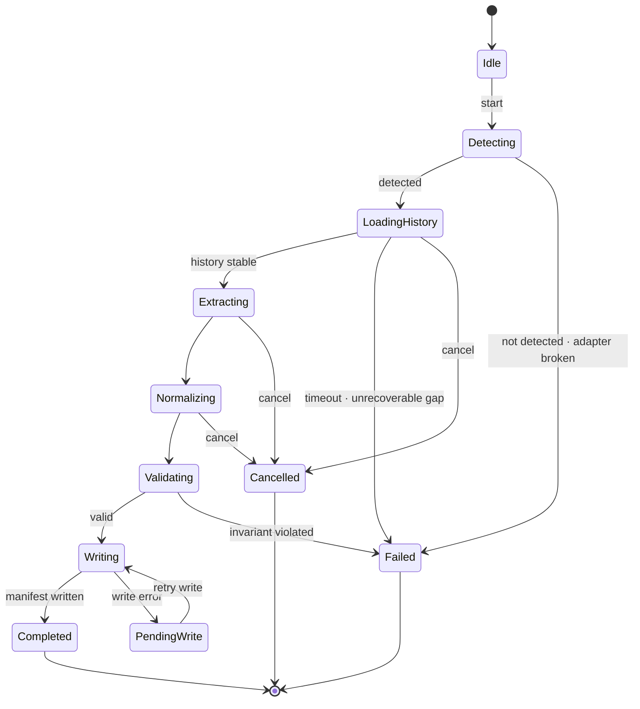

# LCA-SPEC-001 — LLM Conversation Exporter

## Specifica Tecnica per implementazione assistita con Claude Code

| Campo | Valore |
|---|---|
| ID documento | LCA-SPEC-001 (ID mantenuto per tracciabilità; il prodotto cambia natura) |
| Revisione | **3.0** — baseline per implementazione (sostituisce integralmente le Rev 1.0 e 2.0) |
| Data | 2026-09-11 |
| Prodotto | LLM Conversation Exporter (nome di lavoro; codice breve `lce`; il nome definitivo è decisione del PO) |
| Product Owner | Andrea |
| Consumatore del contratto | Modulo di ingestion e archiviazione documentale dell'agentic OS del PO ("**modulo di ingestion**" nel seguito) |
| Destinatari | Claude Code (implementazione), Product Owner, chi sviluppa il modulo di ingestion |
| Classificazione | Interno — nessun dato riservato |
| Budget | Zero (§1.4) |
| Licenza prevista | Apache-2.0 (ADR-013) |

### Storia delle revisioni

| Rev | Modifiche |
|---|---|
| 1.0 | Prima baseline: estensione = archivio completo (RAW, canonico, proiezioni, sync, verify, vault Obsidian) |
| 2.0 | Correzioni di correttezza (espansione per finestra, Quick/Full Sync, allineamento, hash a tre livelli), pattern ridotti, piano risk-first |
| 3.0 | **Cambio di perimetro**: l'estensione **esporta** bundle autoconsistenti in una cartella di ingestion; archivio, riconciliazione tra catture, indicizzazione, chunking, proiezione Markdown e ricerca passano al modulo di ingestion. Rimossi: vault, Full/Quick Sync, Verify, Rebuild index, proiezioni `.md`/`.jsonl`, indice `conversations.jsonl`, migrazioni di file archiviati. Aggiunti: contratto di export (bundle con marker di completamento), file di ancoraggio opzionale scritto dall'OS (Fase 2), annotazioni utente (progetto, tag, nota), guida per il modulo di ingestion (Appendice D) |

### Convenzioni normative

RFC 2119: **DEVE / NON DEVE**, **DOVREBBE / NON DOVREBBE**, **PUÒ**. Identificatori: `FR-`, `NFR-`, `CON-`, `ADR-`, `WP-`, `RSK-`. Ogni test riporta l'ID coperto. **[normativo]** vincola; **[informativo]** spiega. Codice e schemi in inglese; prosa in italiano.

---

## 0. Guida alla lettura per Claude Code [normativo]

1. Precedenza: `CLAUDE.md` → §14 Standard → §6 Contratto di export → resto. Conflitto irrisolvibile → fermarsi e chiedere al PO.
2. Un Work Package alla volta (§15). Definition of Done (§14.3) prima di procedere.
3. **Il contratto di export (§6) è la parte più importante del prodotto**: ogni modifica ai campi, ai nomi file o alla semantica di completamento richiede un ADR e un bump di `schema_version`.
4. Non inventare struttura DOM dei provider (Appendice C = indizi). Fixture mancante → implementare con gli indizi, marcare `@fixture-pending`, voce in `docs/TODO-HUMAN.md`.
5. Dipendenze fuori da §14.4 → approvazione del PO.
6. Pattern: solo gli obbligatori di §5.7 e quelli richiesti da un problema presente.
7. Checkpoint (§15.3): fine WP-02 e fine WP-04.

---

## 1. Executive summary [informativo]

### 1.1 Cosa fa il prodotto

Un'estensione Chromium (MV3, Chrome/Edge) che cattura dal DOM la conversazione aperta con ChatGPT, Claude o Gemini — **tutta**, anche se lunga, virtualizzata o con contenuti collassati — la normalizza in un formato canonico indipendente dal provider e la scrive come **bundle di export autoconsistente** in una cartella scelta dall'utente, da cui il modulo di ingestion la preleva. Localmente, senza rete, senza telemetria, senza endpoint privati.

### 1.2 Cosa NON fa (e chi lo fa)

| Responsabilità | Estensione | Modulo di ingestion |
|---|---|---|
| Cattura dal DOM, espansione, accumulo, gestione virtualizzazione | **✔** | — |
| Conoscenza dei provider (selettori, ruoli, blocchi) | **✔** | — (non parsa mai HTML dei provider) |
| Normalizzazione in schema canonico, hash semantici, sanitizzazione URL | **✔** | — |
| Bundle di export con marker di completamento e hash dei file | **✔** | Verifica all'ingestione |
| Identità d'archivio delle conversazioni e dei messaggi tra catture | — | **✔** (Appendice D) |
| Riconciliazione incrementale (added / revised / absent), dedup di catture ripetute | — | **✔** |
| Indicizzazione, chunking, embedding, ricerca | — | **✔** |
| Proiezione Markdown/Obsidian, layout dell'archivio | — | **✔** (proiezione di riferimento in Appendice D) |
| Ancora per export "solo coda" (Fase 2) | Legge il file, se presente | **Scrive** il file |

### 1.3 Principi

| # | Principio | Conseguenza |
|---|---|---|
| P1 | L'estensione è **stateless rispetto all'archivio** | Nessuna verità sul passato nell'estensione: solo cache locali non autoritative (UX) |
| P2 | Ogni export è un **bundle immutabile e autoconsistente** | Scrittura write-once; completamento segnalato da `manifest.json` scritto per ultimo |
| P3 | Conoscenza dei provider in un solo posto | Il modulo di ingestion consuma solo il canonico |
| P4 | Il canonico è il contratto; il RAW è l'assicurazione | Il RAW consente ri-normalizzazione futura senza ri-scraping |
| P5 | Zero network, permanente | CSP + test statico; eccezioni solo via ADR |
| P6 | Enterprise = invarianti forti, test forti, contratto stabile, minima complessità | 8 pattern obbligatori (§5.7), niente di più |

### 1.4 Budget zero [normativo]

Toolchain, CI (GitHub Actions), distribuzione (GitHub Releases + "Load unpacked"; Edge Add-ons gratuito): 0 €. Chrome Web Store (5 USD una tantum): rinviato (ADR-013); avviso "modalità sviluppatore" in Chrome accettato.

---

## 2. Analisi delle opzioni di perimetro [informativo]

| Opzione | Valutazione | Motivazione |
|---|---|---|
| A. Un file Markdown per coppia Q&A (id chat + id Q&A nei metadati) | **Respinta** | `grep`/`ripgrep` scansionano byte, non file: nessun risparmio; il beneficio reale (payload piccolo per un agente) è un problema di **chunking in ingestion**, non di storage. La frammentazione perde il contesto tra turni, complica la riconciliazione (quale file cambia a una rigenerazione?), degrada Obsidian con migliaia di stub e richiede un indice per ricostruire la chat — cioè il lavoro del modulo di ingestion |
| B. Solo JSON per querying e "continuazione" delle chat | **Parzialmente accolta** | Il JSON è il contratto macchina; il Markdown è una proiezione umana che spetta a chi possiede l'archivio. "Continuare le chat in locale" è un prodotto separato; il canonico lo abilita come contesto |
| C. L'estensione esporta; il modulo di ingestion crea e ottimizza l'archivio | **Accolta** | Separazione corretta: le responsabilità che richiedono lo *stato dell'archivio* (identità tra catture, absent/revised, indice, verify) escono dall'estensione, che si concentra sull'unica cosa che nessun altro componente può fare: catturare il DOM. Condizioni: conoscenza dei provider solo nell'estensione; contratto di export formale |

Sul costo in token: la dimensione dei file a riposo non entra nel modello; ci entra ciò che il retrieval seleziona. Il chunk naturale è il messaggio (già un record nel canonico); finestre Q&A con sovrapposizione sono una scelta del chunker. Se una proiezione Markdown diventa troppo grande per Obsidian, si spezza la **proiezione** nel modulo di ingestion, mai il canonico.

---

## 3. Perimetro [normativo]

### 3.1 In scope (v1.0)

- Provider: ChatGPT, Claude, Gemini — conversazione aperta nella scheda attiva.
- Cattura completa (scansione intera; `scan_scope: 'full'`): testo, codice, immagini e allegati (**metadati**), tool call e ragionamento se e come esposti dalla UI; punti di branch rilevati.
- Normalizzazione canonica, hash semantici, sanitizzazione URL, annotazioni utente (progetto, tag, nota) e nome progetto del provider se esposto.
- Bundle di export: `raw.json`, `capture.json`, `manifest.json` in `inbox/<platform>/<conversation_key>/<capture_id>/`.
- Sink: cartella scelta via File System Access API (con verifica di rilettura) **oppure** `Downloads/LLM-Exports/` (entrambi write-only, entrambi di prima classe).
- Cache locale non autoritativa per UX (ultimo export per conversazione, annotazioni ricordate); bundle in attesa per *Retry write*.
- UI Side Panel + Opzioni; IT/EN. Chrome/Edge ≥ 120.

### 3.2 Out of scope

| Elemento | Destinazione |
|---|---|
| Archivio, riconciliazione, indici, ricerca, Markdown | Modulo di ingestion (Appendice D) |
| Export "solo coda" con ancora scritta dall'OS | Fase 2 (WP-09), contratto già definito in §6.6 |
| Indicatore "nuovi dal precedente export" | Fase 2 (WP-09) |
| Download binario allegati | Non ammesso senza ADR che riscriva §11 (rete) |
| Traversal branch alternativi | Backlog |
| CLI `renormalize` (RAW → canonico in Node, per il modulo di ingestion) | Fase 2/3, se lo stack dell'OS non può eseguire `@lce/core` |
| Native Messaging, Firefox | Fase 3 |
| Endpoint interni dei provider | Escluso per principio (ADR-006) |

### 3.3 Assunzioni

- A1. Utente autenticato nel provider; nessuna credenziale gestita dall'estensione.
- A2. Il modulo di ingestion legge dalla cartella `inbox/` e **sposta o marca** i bundle ingeriti; l'estensione non li tocca dopo il completamento.
- A3. Il DOM dei provider cambia senza preavviso: manutenzione degli adapter ricorrente (runbook §13.6).
- A4. Uso su conversazioni proprie; account aziendali soggetti alle policy dell'organizzazione (§11.6).

---

## 4. Requisiti [normativo]

### 4.1 Funzionali

| ID | Requisito | Pri | WP |
|---|---|---|---|
| FR-001 | Rilevare se la scheda attiva contiene una conversazione supportata: provider, piattaforma, titolo, `provider_conversation_id`, nome progetto del provider se esposto | Must | 03 |
| FR-002 | Caricare l'intera cronologia con scroll controllato fino a stabilità, timeout e limiti configurabili | Must | 03 |
| FR-003 | Accumulare i messaggi **durante** lo scroll e fondere le finestre (liste virtualizzate); discontinuità non risolta → `gap_detected` e `capture_status: incomplete` | Must | 03,05 |
| FR-004 | Espandere i contenuti collassati **in ogni finestra prima della raccolta**; fallimento → `expand_failed` sul messaggio | Must | 03 |
| FR-005 | Normalizzare in blocchi tipizzati (`text`, `code`, `image`, `file`, `tool_call`, `thinking`, `unknown`) con ruolo, modello e timestamp se esposti (mai inventati), citazioni, allegati (metadati) | Must | 03 |
| FR-006 | `content_sha256` semantico per messaggio e per conversazione (§8.3); hash dei byte di `raw.json` e `capture.json` in `manifest.json` | Must | 01,04 |
| FR-007 | `capture_id` ULID per bundle; `id` ULID per messaggio (identità **entro la cattura**); `provider_message_id` conservato | Must | 01 |
| FR-008 | Validazione (schema + invarianti §6.4) prima della scrittura di `capture.json`; violazione → bundle non completato (nessun manifest), RAW comunque scritto, errore all'utente | Must | 03,04 |
| FR-009 | Scrittura del bundle nell'ordine `raw.json` → `capture.json` → `manifest.json`; il manifest è scritto solo dopo il completamento **verificato** dei file precedenti (§9.2) | Must | 04 |
| FR-010 | Sink a scelta: cartella via FSA o downloads; entrambi scrivono solo file nuovi | Must | 02,04 |
| FR-011 | Annotazioni utente nel Side Panel: progetto, tag, nota → `user_annotations`; il progetto è ricordato per conversazione (cache) e proposto al prossimo export | Should | 04 |
| FR-012 | Report finale: conteggi per ruolo, blocchi, espansioni, warning, percorso del bundle, esito verifica di rilettura | Must | 03,04 |
| FR-013 | Annullamento di una cattura in corso senza bundle parziali marcati completi | Must | 03,04 |
| FR-014 | `probe()` dell'adapter: essenziali mancanti → `Broken` (export impedito); non essenziali → `Degraded` (warning, `incomplete`) | Must | 03 |
| FR-015 | Scrittura fallita → bundle in attesa in IndexedDB; *Retry write* riscrive **lo stesso** bundle (stesso `capture_id`) nella stessa cartella | Should | 05 |
| FR-016 | Bundle diagnostico esportabile senza contenuti né titoli | Should | 08 |
| FR-017 | Inizializzazione della cartella di export: `schema/` con i JSON Schema, `README.md`, `export-root.json` (versione layout); layout con versione superiore → rifiuto | Must | 04 |
| FR-018 | UI IT/EN | Should | 08 |
| FR-019 | Sanitizzazione URL (§8.5) nel canonico e nel RAW | Must | 03 |
| FR-020 | Cache locale: per `(platform, conversation_key)` ultimo `capture_id`, data, numero messaggi, annotazioni — **mai** usata per decidere cosa esportare | Should | 04 |
| FR-021 | (Fase 2) Se esiste `state/<platform>/<conversation_key>.anchor.json` (§6.6) e il sink può leggere: mostrare lo stato d'archivio e offrire **Export coda** (`scan_scope: 'tail'`) | Could | 09 |

### 4.2 Non funzionali

| ID | Requisito |
|---|---|
| NFR-001 | 600 messaggi già caricati: ≤ 20 s esclusi i tempi imposti dal provider; normalizzazione+hash ≤ 5 ms/messaggio mediano |
| NFR-002 | Nessun task > 50 ms sul thread UI della pagina (chunking + yield) |
| NFR-003 | Memoria aggiuntiva della scheda ≤ 200 MB per 1.000 messaggi |
| NFR-004 | Bundle mai marcato completo se un file non è stato scritto e (con FSA) verificato in rilettura; con downloads, il completamento di ogni file è atteso via `downloads.onChanged` prima del successivo |
| NFR-005 | Determinismo: stessa conversazione, stesso adapter → stessi `content_sha256` (test property-based) |
| NFR-006 | **Zero rete, permanente**: CSP `connect-src 'none'`; test statico sul bundle di produzione incluso il content script |
| NFR-007 | Permessi minimi (§11.2); nessun MAIN world; nessun codice remoto |
| NFR-008 | Log senza contenuti né titoli (`LogSafeValue`) |
| NFR-009 | Cambio DOM di un provider → un solo package; ripristino ≤ 1 giorno/persona |
| NFR-010 | Copertura: `@lce/core` ≥ 90% (canon, hash, slug, path, sanitizeUrl: 100%); `@lce/adapters` ≥ 80% |
| NFR-011 | Confini tra layer verificati da lint |
| NFR-012 | `@lce/core` compila e passa i test in Node (riuso dal modulo di ingestion o dalla CLI) |
| NFR-013 | Chrome/Edge ≥ 120; Side Panel assente → apertura come scheda |
| NFR-014 | Ogni errore: messaggio localizzato + rimedio |
| NFR-015 | Tastiera, ARIA, contrasto AA |
| NFR-016 | `schema_version` semver in ogni file; contratto additivo entro la major |
| NFR-017 | Content script ≤ 300 kB minificato |
| NFR-018 | Il modulo di ingestion DEVE poter validare ogni bundle con i soli JSON Schema pubblicati e `tools/validate-bundle` (nessuna dipendenza dall'estensione) |

### 4.3 Vincoli

| ID | Vincolo |
|---|---|
| CON-001 | MV3: il service worker non ha DOM → parsing nel content script |
| CON-002 | Filesystem solo via FSA (consenso), downloads (sotto `Downloads/`), Native Messaging (Fase 3) |
| CON-003 | Budget zero |
| CON-004 | Design pattern obbligatori dove risolvono un problema presente (§5.7); altri vietati senza ADR |
| CON-005 | Nessun endpoint interno dei provider |
| CON-006 | Filesystem Windows: caratteri e nomi riservati, lunghezza percorso |
| CON-007 | Un solo maintainer assistito da Claude Code |
| CON-008 | Il modulo di ingestion è esterno e con stack non noto: il contratto DEVE essere consumabile da qualsiasi linguaggio (JSON + JSON Schema) |

---
## 5. Architettura [normativo salvo dove indicato]

### 5.1 Layer e dipendenze

```
UI (Side Panel, Options)          Preact; nessuna logica di dominio
Application                       ExportUseCase · RetryWriteUseCase · (Fase 2) TailExportUseCase; porte
Domain  (@lce/core)               schema, normalizer, canon/hash, sanitizeUrl, path, invarianti — zero API browser
Infrastructure                    ExportSink (FSA, downloads, memory) · LocalCacheRepository (IndexedDB) ·
                                  PageGateway (Port) · settings · logger
Provider Adapters (@lce/adapters) CaptureEngine + adapter per piattaforma (DOM → RawMessage)
```

| Da → verso | domain | application | adapters | infrastructure | ui |
|---|---|---|---|---|---|
| **domain** | ✔ | ✘ | ✘ | ✘ | ✘ |
| **application** | ✔ | ✔ | ✘ (porte) | ✘ (porte) | ✘ |
| **adapters** | ✔ | ✘ | ✔ | ✘ | ✘ |
| **infrastructure** | ✔ | ✔ | ✔ | ✔ | ✘ |
| **ui** | ✔ (tipi) | ✔ | ✘ | ✘ | ✔ |

Composition root per contesto: `content/main.ts`, `sidepanel/main.ts`, `options/main.ts`, `background/main.ts`.

### 5.2 Contesti MV3

| Contesto | Responsabilità |
|---|---|
| **Content script** (isolated world) | Rilevamento; `CaptureEngine` (scroll, espansione per finestra, raccolta, merge); normalizzazione, hash, validazione; streaming a chunk sulla Port |
| **Side Panel** (host applicativo) | Use case; assemblaggio del bundle; scrittura tramite sink; cache locale; UI e report |
| **Options** | Impostazioni; scelta cartella (picker FSA con gesto utente); inizializzazione export root |
| **Service worker** | Solo ciclo di vita: `openPanelOnActionClick`, iniezione on-demand, badge |
| **IndexedDB** | Cache locale (`exports`), `pending_bundles`, `handles`, `logs` — tutto non autoritativo tranne `handles` |
| **storage.local** | Impostazioni (Zod) |

Invocazione: `UI → useCase.execute(input, { onProgress, signal }) → porte`. Nessun bus.

### 5.3 Container



### 5.4 Flusso di export



### 5.5 Macchina a stati della sessione



Tabella di transizioni dichiarata + `transition(from, to)` che lancia `IllegalStateTransitionError`. Niente classi per stato.

### 5.6 Canale unico [normativo]

- Il Side Panel apre `browser.tabs.connect(tabId, { name: 'lce' })`; il content script accetta su `runtime.onConnect`. Comandi in una direzione, progressi/chunk/esiti nell'altra.
- Connessione impossibile → richiesta al SW di iniezione on-demand, un ritentativo, poi `ContentScriptUnavailable`. `onDisconnect` in sessione → `ContentScriptDisconnected`; i chunk già ricevuti PUÒ essere scritti come bundle `incomplete` su conferma dell'utente.
- Messaggi `{ protocol_version: 1, type, payload }` validati con **Zod da entrambe le parti**; chunk ≤ 50 messaggi o 512 kB; `seq` monotono.

| Direzione | Tipo | Payload |
|---|---|---|
| SP→CS | `detect` | — |
| CS→SP | `detect.result` | platform, title, provider_conversation_id, provider_project_name, visible_count, health |
| SP→CS | `capture.start` | `{ session_id, scan_scope: 'full' \| 'tail', options, anchor: Anchor \| null }` |
| SP→CS | `capture.cancel` | `{ session_id }` |
| CS→SP | `capture.progress` | `{ session_id, phase, counts: { visible, accumulated, expanded }, pass, elapsed_ms }` |
| CS→SP | `capture.chunk` | `{ session_id, seq, raw: RawMessage[], canonical: Message[] }` |
| CS→SP | `capture.complete` | `{ session_id, stats, warnings, page, scan_scope }` |
| CS→SP | `capture.error` | `{ session_id, code, detail }` |

### 5.7 Design pattern (CON-004) [normativo]

**Obbligatori (8)** — nominati con `@pattern <Nome> — <problema>`:

| Pattern | Dove | Problema |
|---|---|---|
| Ports & Adapters | Package e matrice §5.1 | Dominio testabile in Node; sink sostituibili |
| Provider Adapter (per composizione) | `ProviderAdapter` per piattaforma consumato da un unico `CaptureEngine` | Un solo algoritmo di cattura; il cambio DOM tocca un modulo |
| Catena ordinata di parser (funzioni pure) | `ContentBlockParsers` | Nodi eterogenei riconosciuti dal primo parser competente |
| Repository | `LocalCacheRepository`, `PendingBundleRepository` dietro interfacce | Cache testabile con implementazioni in memoria |
| Sequenza di scrittura con marker di completamento (forma di Unit of Work) | `writeBundle()` §9.2 | Bundle mai marcato completo se un passo fallisce; ripresa dal passo fallito |
| Finite State Machine | `ExportSession` §5.5 | Transizioni illegali impossibili |
| Result type | `Result<T, DomainError>` | Errori espliciti nel tipo |
| Dependency Injection manuale | Un composition root per contesto | Testabilità; nessun Singleton |

**Ammessi senza formalità**: `withRetry(fn)` sulle scritture; `MemoryExportSink` per i test; `resolveAdapter(url)`; `switch` esaustivo sui blocchi.

**Non introdurre senza ADR**: Visitor, Command Bus, Event Bus, Mediator, Facade aggiuntive, gerarchie Decorator, Builder per oggetti dello schema, Specification, Memento come classe, Template Method per ereditarietà, Strategy con una sola implementazione.

Anti-pattern vietati: God object; stringhe magiche; `chrome.*`/`browser.*` fuori da `infrastructure/`/`entrypoints/`; `any`; Singleton; logica nella UI; timer senza `AbortSignal`; pattern "per completezza".

---

## 6. Contratto di export [normativo — cuore del prodotto]

### 6.1 Layout della cartella di export (`export_layout_version: 1`)

```
<ExportRoot>/                                   # cartella scelta dall'utente (FSA) oppure Downloads/LLM-Exports/
├── export-root.json                            # { export_layout_version: 1, producer, created_at, schema_versions }
├── README.md                                   # semantica del contratto per chi apre la cartella senza l'estensione
├── schema/                                     # JSON Schema pubblicati (draft 2020-12), copiati alla prima scrittura
│   ├── capture.schema.v1.json
│   ├── raw-capture.schema.v1.json
│   ├── manifest.schema.v1.json
│   └── anchor.schema.v1.json
├── inbox/                                      # PRODOTTO dall'estensione, CONSUMATO dal modulo di ingestion
│   └── <platform>/<conversation_key>/<capture_id>/
│       ├── raw.json                            # 1° — frammenti DOM (assicurazione)
│       ├── capture.json                        # 2° — canonico (contratto)
│       └── manifest.json                       # 3° e ULTIMO — hash e dimensioni: la sua presenza = bundle completo
└── state/                                      # SCRITTO dal modulo di ingestion, LETTO dall'estensione (Fase 2, FSA soltanto)
    └── <platform>/<conversation_key>.anchor.json
```

- `conversation_key` = `provider_conversation_id` sanitizzato (ASCII `[a-z0-9-_]`, ≤ 64 caratteri) oppure `nokey` se il provider non espone un ID (il modulo di ingestion riconcilia per contenuto).
- `capture_id` = ULID (26 caratteri, ordinabile nel tempo): unico per bundle, univoco globalmente.
- Percorso relativo massimo ≈ `inbox/` + platform (7) + key (64) + ULID (26) + `manifest.json` ≈ 120 caratteri: entro il budget Windows (§9.3).
- L'estensione **non modifica né cancella mai** nulla sotto `inbox/`; il modulo di ingestion sposta o marca i bundle ingeriti. L'estensione non legge nulla sotto `inbox/`.

### 6.2 Semantica di completamento e idempotenza

1. Un bundle è **completo** se e solo se `manifest.json` esiste ed elenca `raw.json` e `capture.json` con hash e dimensioni; il modulo di ingestion DEVE ignorare bundle senza manifest e PUÒ metterli in quarantena se più vecchi di 24 h (cattura interrotta).
2. Il modulo di ingestion DEVE verificare gli hash dichiarati nel manifest prima di ingerire; mismatch → bundle scartato e segnalato.
3. `capture_id` è la chiave di idempotenza: lo stesso bundle ingerito due volte NON DEVE produrre effetti aggiuntivi.
4. Un *Retry write* riscrive lo **stesso** bundle (stesso `capture_id`, stessi byte) nella stessa cartella; con FSA i file esistenti identici vengono lasciati; con downloads `conflictAction: 'overwrite'`.
5. Ordine tra catture della stessa conversazione: `capture_id` (tempo ULID), poi `capture.captured_at`; `capture.previous_capture_id` è un **suggerimento** dalla cache locale, non un vincolo.

### 6.3 `capture.json` — `CanonicalCapture` v1.0.0 (Zod è l'unica definizione; JSON Schema generato)

```ts
// packages/core/src/schema/capture.v1.ts
export const SCHEMA_VERSION = '1.0.0' as const;
export const Ulid = z.string().regex(/^[0-9A-HJKMNP-TV-Z]{26}$/);
export const Sha256Hex = z.string().regex(/^[a-f0-9]{64}$/);
export const IsoDateTime = z.string().datetime({ offset: true });
export const Provider = z.enum(['openai', 'anthropic', 'google', 'other']);
export const Platform = z.enum(['chatgpt', 'claude', 'gemini', 'other']);
export const Role = z.enum(['user', 'assistant', 'system', 'tool']);
export const ScanScope = z.enum(['full', 'tail']);

export const TextBlock     = z.object({ type: z.literal('text'), markdown: z.string() });
export const CodeBlock     = z.object({ type: z.literal('code'), language: z.string().nullable(), code: z.string(), filename: z.string().nullable() });
export const ImageBlock    = z.object({ type: z.literal('image'), alt: z.string().nullable(), attachment_id: Ulid.nullable(), source_url: z.string().nullable() });
export const FileBlock     = z.object({ type: z.literal('file'), name: z.string(), attachment_id: Ulid.nullable(), source_url: z.string().nullable() });
export const ToolCallBlock = z.object({ type: z.literal('tool_call'), tool_name: z.string().nullable(),
                               status: z.enum(['requested', 'completed', 'failed', 'unknown']),
                               input_markdown: z.string().nullable(), output_markdown: z.string().nullable() });
export const ThinkingBlock = z.object({ type: z.literal('thinking'), markdown: z.string(), summarized: z.boolean() });
export const UnknownBlock  = z.object({ type: z.literal('unknown'), markdown: z.string(), reason: z.string() });
export const ContentBlock  = z.discriminatedUnion('type', [TextBlock, CodeBlock, ImageBlock, FileBlock, ToolCallBlock, ThinkingBlock, UnknownBlock]);

export const Citation   = z.object({ index: z.number().int().nonnegative(), title: z.string().nullable(), url: z.string().nullable(), snippet: z.string().nullable() });
export const Attachment = z.object({ id: Ulid, kind: z.enum(['image', 'file']), name: z.string().nullable(), mime_type: z.string().nullable(),
                            size_bytes: z.number().int().nonnegative().nullable(), source_url: z.string().nullable() });
export const Warning    = z.object({ code: z.string(), message: z.string(), message_id: Ulid.nullable() });

export const Message = z.object({
  id: Ulid,                                   // identità ENTRO questa cattura; il modulo di ingestion PUÒ adottarla come identità d'archivio al primo avvistamento
  ordinal: z.number().int().nonnegative(),    // posizione nel branch attivo, da 0, contiguo
  provider_message_id: z.string().nullable(),
  role: Role,
  author_name: z.string().nullable(),
  model: z.string().nullable(),
  created_at: IsoDateTime.nullable(),
  content: z.array(ContentBlock).min(1),
  citations: z.array(Citation),
  attachment_ids: z.array(Ulid),
  content_sha256: Sha256Hex,                  // §8.3 — semantico, stabile tra catture
  match_hints: z.object({ dom_text_sha256: Sha256Hex.nullable() }),   // indipendente dal normalizer; dipende dall'adapter
  metadata: z.record(z.string(), z.unknown()),
});

export const BranchPoint = z.object({ message_id: Ulid, sibling_index: z.number().int().positive().nullable(), sibling_count: z.number().int().positive().nullable() });
export const BranchInfo  = z.object({ has_branches: z.boolean(), captured_branch: z.literal('active'), branch_points: z.array(BranchPoint) });

export const CaptureInfo = z.object({
  capture_id: Ulid,
  captured_at: IsoDateTime,
  scan_scope: ScanScope,                      // v1: sempre 'full'
  anchor: z.object({ anchor_written_at: IsoDateTime, matched_messages: z.number().int() }).nullable(),  // solo 'tail'
  previous_capture_id: Ulid.nullable(),       // suggerimento dalla cache locale
  capture_status: z.enum(['complete', 'incomplete']),
  warnings: z.array(Warning),
});

export const ConversationInfo = z.object({
  provider: Provider, platform: Platform,
  provider_conversation_id: z.string().nullable(),
  provider_project_name: z.string().nullable(),     // se la UI del provider lo espone
  title: z.string().min(1),
  source_url: z.string().url(),                     // origin + pathname
  created_at: IsoDateTime.nullable(), updated_at: IsoDateTime.nullable(),
  language: z.string().nullable(), models: z.array(z.string()),
  message_count: z.number().int().nonnegative(),
  content_sha256: Sha256Hex,
  branch_info: BranchInfo,
});

export const UserAnnotations = z.object({ project: z.string().nullable(), tags: z.array(z.string()), note: z.string().nullable() });

export const Provenance = z.object({
  extension_version: z.string(), core_version: z.string(),
  adapter: z.object({ name: z.string(), version: z.string(), selectors_version: z.string() }),
  capture_method: z.literal('dom'),
  browser: z.object({ name: z.string(), version: z.string() }).nullable(),
  raw_file: z.object({ name: z.literal('raw.json'), sha256: Sha256Hex }).nullable(),
});

export const CanonicalCapture = z.object({
  schema_version: z.literal(SCHEMA_VERSION),
  capture: CaptureInfo,
  conversation: ConversationInfo,
  user_annotations: UserAnnotations,
  messages: z.array(Message),
  attachments: z.array(Attachment),
  provenance: Provenance,
});
```

Regole: campo assente = `null`; timestamp solo da valori non ambigui (relativi → `null` + `timestamp_relative_ignored`); `title` con fallback (primo messaggio utente ≤ 80 caratteri, poi `"Untitled conversation"`); `models` = unione dei `model` dei messaggi; `language` euristica o `null`. Tipi di dominio `readonly`, ID *branded*.

### 6.4 Invarianti (`validateInvariants(capture): Violation[]`)

1. `ordinal` contigui da 0. 2. `id` unici; `provider_message_id` unici tra i non nulli. 3. `attachment_ids` riferiscono ad `attachments[].id`. 4. `message_count === messages.length`. 5. `content_sha256` di conversazione e messaggi coincidono con il ricalcolo. 6. `content.length ≥ 1` (vuoto → `TextBlock{ "" }` + `empty_message`). 7. `scan_scope === 'tail'` ⇒ `capture.anchor` non nullo. 8. `provenance.raw_file` non nullo se `raw.json` è stato scritto.

### 6.5 `raw.json` — `RawCapture` v1.0.0 e `manifest.json` — `Manifest` v1.0.0

```ts
export const RawMessage = z.object({
  seq: z.number().int(), provider_message_id: z.string().nullable(),
  role_hint: z.enum(['user', 'assistant', 'system', 'tool', 'unknown']),
  outer_html: z.string(),                      // frammento dopo stripSelectors e sanitizzazione URL; altrimenti verbatim
  dom_text_sha256: Sha256Hex,
  expansion_state: z.enum(['not_applicable', 'expanded', 'collapsed_unresolved']),
  model_hint: z.string().nullable(), timestamp_hint: z.string().nullable(),
  branch_hint: z.object({ index: z.number().int().nullable(), count: z.number().int().nullable() }).nullable(),
});
export const RawCapture = z.object({
  raw_schema_version: z.literal('1.0.0'), capture_id: Ulid, platform: Platform, source_url: z.string(), captured_at: IsoDateTime,
  scan_scope: ScanScope,
  page: z.object({ title: z.string(), viewport: z.object({ w: z.number(), h: z.number() }), user_agent_brand: z.string().nullable() }),
  adapter: z.object({ name: z.string(), version: z.string(), selectors_version: z.string() }),
  messages: z.array(RawMessage),
  stats: z.object({ passes: z.number().int(), duration_ms: z.number().int(), expanded: z.number().int(), expand_failed: z.number().int(),
                    gaps: z.number().int(), url_redactions: z.number().int() }),
});

export const Manifest = z.object({
  manifest_version: z.literal('1.0.0'),
  capture_id: Ulid, platform: Platform, conversation_key: z.string(), provider_conversation_id: z.string().nullable(),
  captured_at: IsoDateTime, completed_at: IsoDateTime,
  files: z.array(z.object({ name: z.enum(['raw.json', 'capture.json']), sha256: Sha256Hex, bytes: z.number().int().positive() })).min(1),
  schema_versions: z.object({ capture: z.string(), raw: z.string() }),
  producer: z.object({ name: z.literal('lce'), version: z.string() }),
  write_verified: z.boolean(),               // true solo con FSA e rilettura riuscita
});
```

`outer_html` è **non fidato**: il modulo di ingestion NON DEVE renderizzarlo né parsarlo per estrarre contenuto (usa `capture.json`); serve solo a una futura ri-normalizzazione con `@lce/core`.

### 6.6 `anchor.json` — scritto dal modulo di ingestion, letto dall'estensione (Fase 2, contratto fissato ora)

```ts
export const Anchor = z.object({
  anchor_version: z.literal('1.0.0'),
  platform: Platform, provider_conversation_id: z.string(),
  archive_conversation_id: z.string(),        // identità nell'archivio dell'OS (opaca per l'estensione)
  archived_message_count: z.number().int().nonnegative(),
  last_ingested_capture_id: Ulid.nullable(),
  written_at: IsoDateTime,
  anchor_messages: z.array(z.object({         // ultimi K (≥ 3, ≤ 10) messaggi archiviati, in ordine
    provider_message_id: z.string().nullable(), dom_text_sha256: Sha256Hex.nullable(),
    content_sha256: Sha256Hex, role: Role,
  })).min(3).max(10),
});
```

Uso: con sink FSA (può leggere) l'estensione cerca `state/<platform>/<conversation_key>.anchor.json`; se esiste ed è valido (Zod, ≤ 256 kB, scritto da meno di 90 giorni) mostra "in archivio: n messaggi, ultimo ingest …" e offre **Export coda**: la scansione si ferma quando almeno 3 degli `anchor_messages` compaiono in ordine (§7.3); il bundle ha `scan_scope: 'tail'` e `capture.anchor` compilato. Il modulo di ingestion tratta un bundle `tail` come **append/revisione della coda**, mai come evidenza di assenza (Appendice D). Il file è **non fidato**: errori di parsing → ignorato con warning `anchor_invalid`, scansione completa.

### 6.7 Versionamento del contratto

- `schema_version` in ogni file. Entro la stessa major: solo aggiunte di campi opzionali/nullable e nuovi valori di enum documentati (il consumatore DEVE tollerare campi sconosciuti e valori enum sconosciuti in `warnings[].code`, `block.type` → trattare come `unknown`).
- Major diversa → nuova cartella `schema/*.v2.json`; il modulo di ingestion rifiuta major sconosciute.
- `tools/validate-bundle <dir>` (Node, senza dipendenze dall'estensione): valida i tre file e gli hash. Distribuito con la release e nella cartella `schema/` come riferimento.

---
## 7. Pipeline di cattura [normativo]

### 7.1 Contratto dell'adapter e del motore

```ts
export interface ProviderAdapter {
  readonly id: Platform; readonly provider: Provider;
  readonly version: string; readonly selectorsVersion: string;
  readonly mediaHostPatterns: readonly RegExp[];       // domini media/CDN del provider (§8.5)
  matches(url: URL): boolean;
  detect(doc: Document): Result<DetectionResult, DomainError>;   // include provider_project_name se esposto
  probe(doc: Document): AdapterHealth;                  // 'healthy' | 'degraded' | 'broken' + checks
  getScrollContainer(doc: Document): Element | null;
  getMessageContainer(doc: Document): Element | null;   // radice del MutationObserver
  collectVisibleMessages(doc: Document): RawMessage[];  // solo elementi montati, ordine DOM
  isHistoryLoading(doc: Document): boolean;
  findCollapsed(scope: Element): Element[];             // espandibili attualmente montati
  expand(el: Element): Promise<boolean>;
  extractPageMetadata(doc: Document): PageMetadata;
}
export function runCapture(adapter, doc, input: { scanScope; anchor: Anchor | null; options }, hooks: { onProgress; onChunk }, signal): Promise<Result<RawCapture>>;
```

`selectors.ts` per adapter (data/versione in commento; `essential: true` sui selettori usati da `probe()`; `stripSelectors` per gli elementi UI da rimuovere prima di `dom_text_sha256` e normalizzazione).

### 7.2 Parametri (default; opzioni avanzate)

| Parametro | Default | Significato |
|---|---|---|
| `scrollStepRatio` | 0.8 | Passo = ratio × altezza contenitore; dimezzato a ogni gap (min 0.2) |
| `settleMs` / `quietMs` | 700 / 400 | Attesa dopo scroll / finestra senza mutazioni (cap 4 × `settleMs`) |
| `stablePasses` | 3 | Passaggi consecutivi in cima senza nuovi messaggi |
| `maxPasses` / `maxDurationMs` | 800 / 300000 | Limiti di sicurezza |
| `expandRetries` | 2 | Tentativi per elemento collassato |
| `anchorMin` | 3 | Corrispondenze in ordine per dichiarare trovata l'ancora (Fase 2) |
| `chunkSize` / `yieldEveryMs` | 50 / 30 | Streaming e yield cooperativo |

### 7.3 Algoritmo del `CaptureEngine`

```
accumulated := sequenza ordinata (merge per sovrapposizione §7.4); passes := stable := gaps := 0
container := adapter.getScrollContainer(doc) ?? Err(ConversationNotDetected)
observer := MutationObserver(adapter.getMessageContainer(doc)) → lastMutationAt

PASS():                                         // ESPANDI → ATTENDI → RACCOGLI → FONDI, per ogni finestra
  for el in adapter.findCollapsed(visibleScope):
     ok := retry(expandRetries, () => adapter.expand(el)); if !ok → 'collapsed_unresolved' + expand_failed
  if espansioni > 0: await quiet(quietMs)
  merge(accumulated, adapter.collectVisibleMessages(doc)); onProgress(...)

LOOP verso l'alto:
  guardie: aborted → Cancelled; tempo/pass oltre i limiti → Failed(HistoryLoadTimeout)
  PASS()
  if scanScope == 'tail' and anchorFound(accumulated, anchor, anchorMin): break
  atTop := scrollTop ≤ 1 and !isHistoryLoading
  if atTop: stable := (nuovi == 0) ? stable+1 : 0; if stable ≥ stablePasses: break
  else: stable := 0; scrollTop -= scrollStepRatio × clientHeight
  await settle; await quiet; passes++

SWEEP verso il basso (tutta la conversazione in 'full'; dall'ancora al fondo in 'tail'): PASS() a ogni passo
PASS() finale
scan_scope_effettivo := (tail richiesto e ancora trovata prima della cima) ? 'tail' : 'full'
status := gaps == 0 ? 'complete' : 'incomplete'
```

- Espansione **prima** della raccolta della stessa finestra; un messaggio riosservato espanso sostituisce la versione collassata.
- Nessun'altra azione oltre scroll ed espansione (niente rigenera, elimina, cambia branch).
- Banner in-page (shadow DOM) "Export in corso — non interagire" con *Annulla*.
- `probe()` = `broken` → export impedito; `degraded` → warning + `incomplete`.

### 7.4 Merge di finestre

Chiave provvisoria: `provider_message_id` se presente, altrimenti `dom_text_sha256` + posizione relativa nella finestra. Vuoto → inserisci; altrimenti trova la sovrapposizione (prefisso della finestra in `accumulated` o suffisso di `accumulated` nella finestra) e inserisci i nuovi; per le chiavi comuni sostituisci con l'osservazione più recente se `expanded` o cambiata. Nessuna sovrapposizione e non adiacente a un estremo → `gaps++`, `gap_detected(pass)`, passo dimezzato. Ordinali assegnati dopo il merge finale. Property test: finestre contigue sovrapposte in ordine misto ⇒ ricostruzione esatta.

### 7.5 Ancoraggio (Fase 2)

`anchorFound`: almeno `anchorMin` degli `anchor_messages` compaiono in `accumulated` nello **stesso ordine relativo** (match per `provider_message_id` oppure `dom_text_sha256`). Regione confrontabile = dal primo messaggio d'ancora matched alla fine. Nessuna ancora entro la cima → scansione completa (`scan_scope: 'full'`, warning `anchor_not_found`).

---

## 8. Normalizzazione, hash, sanitizzazione [normativo]

### 8.1 Collocazione

`normalize(raw: RawCapture, ctx): Result<CanonicalDraft>` pura in `@lce/core`; `ctx` fornisce `HtmlParser` (browser `DOMParser`; Node `linkedom`), `Clock`, `IdGenerator`, `Hasher`. Eseguita nel content script a chunk con yield.

### 8.2 Catena di parser e regole HTML → Markdown

`[parseCodeBlock, parseToolCall, parseThinking, parseImage, parseFile, parseText]`, funzioni pure `(node, ctx) => ContentBlock[] | null`; `parseText` = Turndown + GFM. Residui non riconosciuti → `UnknownBlock{ reason }`. Le proiezioni (anteprima) usano `switch` esaustivo.

| Elemento | Regola |
|---|---|
| Codice | Fence con linguaggio se esposto; backtick nel fence > sequenza massima nel codice (min 3); inline con backtick singolo/doppio |
| Tabelle / liste | GFM; `\|` escapato; `-` / `1.`; indentazione 2 |
| Formule | LaTeX sorgente se esposto; altrimenti testo renderizzato + `math_rendered_only` |
| Link / immagini | `[testo](url)`; `ImageBlock` con `alt` e `source_url` sanitizzato |
| Citazioni numerate | `citations[]`; marcatore `[n]` nel testo |
| Whitespace | Righe vuote > 2 collassate; `&nbsp;` → spazio; zero-width rimossi |
| HTML residuo | Mai emesso: convertito o scartato con warning |

### 8.3 Hash

| Hash | Dove | Calcolo | Domanda |
|---|---|---|---|
| `message.content_sha256` | `capture.json` | `sha256(role + '\u001D' + blocks.map(b => b.type + '\u001E' + canon(primary_text(b))).join('\u001E'))`; `canon` = NFC → CRLF→LF → trim trailing per riga → trim finale; esclusi ID, timestamp, modello, citazioni, allegati | Il contenuto è cambiato? |
| `conversation.content_sha256` | `capture.json` | `sha256(messages.map(content_sha256).join('\n'))` per ordinale | La conversazione è cambiata? |
| `manifest.files[].sha256` | `manifest.json` | sha256 dei byte scritti (rilettura con FSA) | Il file è integro? |
| `match_hints.dom_text_sha256` | `capture.json` | `sha256(canon(textContent(frammento pulito)))` | Stesso frammento DOM tra catture, indipendentemente dal normalizer |

`primary_text`: text→markdown · code→`(language ?? '') + US + code` · image→`alt ?? ''` · file→name · tool_call→`(tool_name ?? '') + US + (input ?? '') + US + (output ?? '')` · thinking→markdown · unknown→markdown (`US = '\u001F'`). Web Crypto. Property test: `canon` idempotente; hash deterministico e indipendente dall'ordine dei campi.

### 8.4 Warning codificati

`gap_detected`, `adapter_degraded`, `expand_failed`, `timestamp_relative_ignored`, `math_rendered_only`, `empty_message`, `unknown_block`, `branch_detected`, `truncated_by_provider`, `url_query_stripped`, `conversation_key_missing`, `anchor_not_found`, `anchor_invalid`, `write_not_verified` (downloads).

### 8.5 Sanitizzazione URL (FR-019)

```
sanitizeUrl(u): hostname(u) ∈ adapter.mediaHostPatterns → origin + pathname (conta url_redactions)
                u == source_url della conversazione   → origin + pathname
                altrimenti (citazioni web esterne)     → invariato
```

Applicata nel RAW agli attributi `src`, `href`, `srcset`, `poster`, `data-*` con valore URL; nel canonico a `source_url` di immagini, file, allegati e conversazione. Documentata in `README.md` della cartella di export.

---

## 9. Persistenza [normativo]

### 9.1 Sink (entrambi write-once, entrambi di prima classe)

```ts
export interface ExportSink {
  readonly kind: 'fsa' | 'downloads' | 'memory';
  readonly capabilities: { canRead: boolean; canVerify: boolean };
  connect(): Promise<Result<ExportRootInfo>>;             // permessi; legge/crea export-root.json e schema/
  writeFile(relPath: string, bytes: Uint8Array): Promise<Result<void>>;        // fallisce se esiste con byte diversi (FSA)
  readFile(relPath: string): Promise<Result<Uint8Array>>;                      // Err(NotSupported) se !canRead
  exists(relPath: string): Promise<Result<boolean>>;
}
```

| Sink | Note |
|---|---|
| `FsaExportSink` | Cartella scelta con `showDirectoryPicker({ mode: 'readwrite' })` dalle Opzioni; handle in IndexedDB; a inizio sessione stato `prompt` → "Riconnetti cartella" (gesto utente). Può leggere: rilettura di verifica e (Fase 2) `state/*.anchor.json` |
| `DownloadsExportSink` | `Downloads/LLM-Exports/<relPath>`; ogni file attende `downloads.onChanged` → `state: 'complete'` prima del successivo; `conflictAction: 'overwrite'`; non può leggere: `manifest.write_verified: false` + warning `write_not_verified`; l'utente DEVE disattivare "Chiedi dove salvare" (documentato) |
| `MemoryExportSink` | Test |

Retry: `withRetry(fn)` 3 tentativi, backoff 200/800/2000 ms su errori transitori.

### 9.2 `writeBundle()` — sequenza con marker di completamento (FR-009)

```
0. connect(); verifica export-root.json (layout ≤ noto) e presenza schema/ (crea se mancante)
1. rawBytes := serialize(raw.json); writeFile(inbox/.../raw.json)
   FSA: readFile → sha256 == sha256(rawBytes) altrimenti Err(WriteVerificationFailed)
2. capture.provenance.raw_file := { name, sha256(rawBytes) }; captureBytes := serialize(capture.json); writeFile(...)
   FSA: rilettura e confronto
3. manifest := { files: [{raw.json, sha, bytes}, {capture.json, sha, bytes}], write_verified: <FSA && verificato>, completed_at: now }
   writeFile(inbox/.../manifest.json)                      // ULTIMO: da qui il bundle è completo
4. cache locale: exports[(platform, conversation_key)] := { last_capture_id, last_captured_at, message_count, user_annotations }
   delete pending_bundles[capture_id]
```

Fallimento in 1–3 → stato `PendingWrite`, bundle serializzato in `pending_bundles` (IndexedDB), *Retry write* riparte dal passo fallito con **gli stessi byte**. Con downloads il passo successivo parte solo dopo `state: 'complete'` del precedente (NFR-004). Serializzazione JSON con chiavi in ordine di schema, indentazione 0, `\n` finale, UTF-8 senza BOM — deterministica, così il retry produce byte identici.

### 9.3 Percorsi (CON-006)

`conversation_key`: `[^a-z0-9-_]` → `-`, lowercase, ≤ 64, fallback `nokey`. Segmenti: rimozione `<>:"/\|?*` e controlli; nessun punto/spazio finale; nomi riservati Windows → suffisso `-x`. Budget percorso relativo ≤ 120 caratteri (verificato dal test: la combinazione massima `inbox/chatgpt/<64>/<26>/manifest.json` = 113). Property test: mai caratteri vietati, mai vuoto, idempotente.

### 9.4 Cache locale (IndexedDB `lce`, versione 1) — non autoritativa

| Store | Chiave | Contenuto |
|---|---|---|
| `exports` | `[platform+conversation_key]` | `{ last_capture_id, last_captured_at, message_count, export_count, user_annotations }` — UX e `previous_capture_id` |
| `pending_bundles` | `capture_id` | Byte serializzati di raw/capture/manifest e passo raggiunto; purge dopo 7 giorni |
| `handles` | `'export_root'` | `FileSystemDirectoryHandle` |
| `logs` | autoincrement | Ring buffer 2.000 eventi |

La cache **non decide mai** cosa esportare; la sua perdita non ha effetti sull'archivio (che è dell'OS).

---

## 10. UI/UX [normativo]

### 10.1 Side Panel

| Area | Contenuto |
|---|---|
| Cartella di export | Nome, tipo sink, stato permesso (Connessa / Riconnetti / Non configurata); con downloads: nota "verifica di rilettura non disponibile" |
| Rilevamento | Piattaforma + salute adapter; titolo; `provider_conversation_id` abbreviato; progetto del provider se esposto; messaggi visibili; dalla cache: "ultimo export: data, n messaggi" (etichettato come locale); (Fase 2) dall'ancora: "in archivio: n messaggi" |
| Annotazioni | Progetto (proposto dall'ultimo export della conversazione, poi dall'ultimo usato), tag, nota |
| Azioni | **Export** · **Cancel** · **Retry write** (se `PendingWrite`) · (Fase 2) **Export coda** se ancora valida |
| Avanzamento | Fasi (Detecting → Loading history → Extracting → Normalizing → Validating → Writing), messaggi accumulati, espansi, pass, tempo |
| Report | Ruoli; blocchi; espansioni; warning con codice; percorso relativo del bundle; `write_verified`; anteprima Markdown del canonico (solo a schermo, non persistita) |
| Piè di pagina | Versione, Opzioni, Esporta diagnostica |

### 10.2 Opzioni

**Cartella di export** (FSA / downloads; stato; inizializza) · **Cattura avanzata** (§7.2) · **Lingua** · **Diagnostica** (livello log, bundle, svuota pending) · **Informazioni** (versione, licenza, PRIVACY, SECURITY, avviso account aziendali).

### 10.3 Regole

Nessuna azione distruttiva sulla cartella di export; ogni errore con causa, rimedio e codice copiabile; stringhe in `_locales/{en,it}`; CSS nativo; componenti Preact funzionali con `@preact/signals`; la UI chiama i use case e rende i progressi, nulla di più.

---
## 11. Sicurezza, privacy, compliance [normativo]

### 11.1 Modello delle minacce

| Minaccia | Vettore | Mitigazione |
|---|---|---|
| Iniezione via contenuto della pagina | HTML/script in un messaggio finisce nel RAW | Il RAW non è mai renderizzato dall'estensione; il contratto dichiara `outer_html` non fidato; il modulo di ingestion usa solo il canonico |
| Messaggi forgiati sulla Port | Pagina compromessa | Isolated world; Zod su ogni messaggio; `session_id` casuale; `seq` verificati; Port aperta dal Side Panel |
| Esfiltrazione | Estensione o dipendenza | `connect-src 'none'`; test statico anti-rete; lockfile, `pnpm audit`, dipendenze minime |
| Credenziali a riposo | URL firmati in `source_url` o nel RAW | Sanitizzazione §8.5 in entrambi i livelli |
| Scrittura fuori dalla cartella | Path traversal in titolo/ID | Sanitizzazione dei segmenti; percorsi relativi all'handle (FSA vieta `..`) |
| **File di ancoraggio ostile** (Fase 2) | `state/*.anchor.json` malformato o gonfiato | Zod, limite 256 kB, sola lettura, ignorato con warning; non influenza mai la validità di un bundle |
| Bundle incompleto ingerito | Crash durante la scrittura | Manifest scritto per ultimo; hash nel manifest; il consumatore verifica |
| Dati sensibili nei log | Log con contenuti | `LogSafeValue` + test |
| Supply chain | Pacchetto compromesso | Lista approvata §14.4, Dependabot, CodeQL, SBOM |

### 11.2 Manifest dell'estensione (permessi minimi)

```json
{
  "manifest_version": 3,
  "name": "__MSG_extName__", "default_locale": "en", "version": "0.1.0", "description": "__MSG_extDescription__",
  "permissions": ["storage", "unlimitedStorage", "sidePanel", "downloads", "scripting", "activeTab"],
  "host_permissions": ["https://chatgpt.com/*", "https://chat.openai.com/*", "https://claude.ai/*", "https://gemini.google.com/*"],
  "background": { "service_worker": "background.js", "type": "module" },
  "action": { "default_title": "__MSG_actionTitle__" },
  "side_panel": { "default_path": "sidepanel.html" },
  "options_ui": { "page": "options.html", "open_in_tab": true },
  "content_scripts": [{ "matches": ["https://chatgpt.com/*", "https://chat.openai.com/*", "https://claude.ai/*", "https://gemini.google.com/*"],
                        "js": ["content.js"], "run_at": "document_idle", "world": "ISOLATED" }],
  "content_security_policy": { "extension_pages": "script-src 'self'; object-src 'self'; connect-src 'none'; img-src 'self' data:; style-src 'self'" },
  "minimum_chrome_version": "120"
}
```

Content script inerte fino a un comando. Ogni modifica a permessi/CSP richiede approvazione del PO.

### 11.3 Zero network — permanente

Nessuna API di rete in alcun modulo, content script incluso. `tools/no-network-check.ts` fallisce alla prima occorrenza nel bundle di produzione. Funzionalità che richiedano rete (download allegati) non ammesse senza un ADR che riscriva questa sezione; fino ad allora Claude Code DEVE rifiutarle.

### 11.4 Dati personali

`PRIVACY.md` (repo e Opzioni): nessuna raccolta, trasmissione, telemetria; permessi con motivazione; posizione dei dati (cartella di export + IndexedDB del profilo); come cancellare tutto; nota sulla redazione degli URL; nota che i bundle contengono il testo integrale delle conversazioni e vanno protetti come qualsiasi dato locale.

### 11.5 Account aziendali e ToS

README e Opzioni: l'export da workspace aziendali è un export di dati aziendali soggetto a policy IT/DLP/retention; verificare i termini di servizio dei provider sull'automazione. Nessuna valutazione legale.

---

## 12. Osservabilità ed errori [normativo]

Porta `Logger` (`debug|info|warn|error`, `data: LogSafeValue`); console in dev, ring buffer IndexedDB, bundle diagnostico (versioni, browser, impostazioni non sensibili, probe, ultimi eventi, statistiche ultima cattura).

| Codice | Quando | Rimedio |
|---|---|---|
| `AdapterNotFound` / `ConversationNotDetected` | URL non supportato / pagina senza conversazione | Aprire una conversazione supportata |
| `AdapterBroken` / `AdapterDegraded` | Selettori essenziali / non essenziali falliti | Aggiornare; segnalare con bundle diagnostico |
| `ContentScriptUnavailable` / `ContentScriptDisconnected` | Port impossibile / chiusa in sessione | Ricaricare la scheda; non navigare durante l'export |
| `HistoryLoadTimeout` | Limiti superati | Aumentare `settleMs`; verificare il provider |
| `ValidationFailed` | Schema/invarianti violati | Bug: allegare bundle diagnostico; RAW scritto |
| `ExportRootNotConnected` / `PermissionDenied` | Cartella assente o permesso negato | Opzioni → Cartella → Connetti / Riconnetti |
| `ExportRootLayoutAhead` | `export-root.json` con layout sconosciuto | Aggiornare l'estensione |
| `WriteFailed` / `WriteVerificationFailed` | I/O / rilettura ≠ byte scritti | Spazio, blocchi su share; *Retry write* |
| `DownloadInterrupted` | `downloads.onChanged` → `interrupted` | Disattivare "Chiedi dove salvare"; *Retry write* |
| `IllegalStateTransition` | FSM violata | Bug interno |
| `Cancelled` | Annullamento | — |

---

## 13. Qualità [normativo]

### 13.1 Piramide

| Livello | Strumento | Ambito |
|---|---|---|
| Unit | Vitest | `@lce/core` (schema, canon/hash, normalizer con `linkedom`, sanitizeUrl, path, invarianti, serializzazione deterministica), application layer con porte finte |
| Property-based | fast-check | `canon` idempotente; hash deterministico; path sicuro; **merge finestre** ricostruisce la sequenza; **serializzazione deterministica** (stesso oggetto ⇒ stessi byte); (Fase 2) ancora tollerante alla rigenerazione dell'ultimo messaggio |
| Contract | Ajv + JSON Schema generato | Esempi Appendice A validi; negativi rifiutati; `tools/validate-bundle` verde sui bundle golden |
| Golden | Vitest snapshot con review | `capture.json`, `manifest.json` per fixture note |
| Adapter DOM contract | Vitest + happy-dom | Fixture → conteggi per ruolo, ID, blocchi codice, elementi espansi, URL sanitizzati |
| E2E | Playwright (`--load-extension`) | Provider sintetico (lazy loading, virtualizzazione a 40, "Show more" in messaggi smontati, branch navigator): Export completo, Cancel, Retry write, sink `memory` e `downloads`; (Fase 2) Export coda con ancora |
| Smoke live (manuale) | `docs/runbooks/release-smoke.md` | Una conversazione reale per provider, FSA reale, `validate-bundle` sul risultato |

Il picker FSA non è automatizzabile: `FsaExportSink` è coperto da unit test con handle finti e dalla smoke manuale.

### 13.2 Performance

Fixture sintetica 1.000 messaggi: NFR-001/002/003, `size-limit` sul content script. Warning in Fase 1, bloccanti dalla Fase 2.

### 13.3 Fixture DOM

`fixtures/<platform>/<selectors_version>/<name>.html` + `<name>.fixture.json` + `README.md`, registrate con *Record fixture* (dev) dopo anonimizzazione (testo sostituito a pari lunghezza, URL sostituiti, `data-*` con ID mantenuti). Tre per provider: breve; con codice/tabelle/immagini; lunga con collassati. Mai contenuto reale nel repo.

### 13.4 Gate CI

`lint (boundaries) → format:check → typecheck → test:unit (coverage) → test:contract → build → test:e2e → size-limit → no-network-check → audit`. Dependabot settimanale; CodeQL.

### 13.5 Release

SemVer; Keep a Changelog; tag → zip `lce-chromium-vX.Y.Z.zip`, `SHA256SUMS`, SBOM CycloneDX, **`schema/` e `validate-bundle` allegati alla release** per il modulo di ingestion. GitHub Releases; Edge Add-ons quando maturo.

### 13.6 Runbook "il provider ha cambiato DOM"

Side Panel *Degraded/Broken* → nuova fixture anonimizzata → `selectors.ts` + `selectorsVersion` + versione adapter → contract test su tutte le fixture → Appendice C, `CHANGELOG.md`, release patch.

---

## 14. Repository, standard, dipendenze [normativo]

### 14.1 Struttura

```
llm-conversation-exporter/
├── CLAUDE.md · README.md · LICENSE · CHANGELOG.md · SECURITY.md · PRIVACY.md · CONTRIBUTING.md
├── docs/  SPEC-LCA-001.md · ARCHITECTURE.md · CONTRACT.md (estratto §6 per il modulo di ingestion) · TEST-STRATEGY.md · TODO-HUMAN.md · adr/ · spikes/ · runbooks/
├── packages/
│   ├── core/       @lce/core      schema/ (capture, raw, manifest, anchor) · normalizer/ · hashing/ · url/ · path/ · serialize/ · invariants/ · result.ts · errors.ts
│   ├── adapters/   @lce/adapters  engine/capture-engine.ts · provider-adapter.ts · chatgpt/ claude/ gemini/ (selectors.ts, adapter.ts)
│   ├── extension/  @lce/extension entrypoints/ (background, content, sidepanel/, options/) · app/ (use-cases/, ports/) · infrastructure/ (sinks/, indexeddb/, page-gateway/, settings/, logger/) · ui/ · public/_locales/{en,it}/
│   └── tools/      validate-bundle (Node, zero dipendenze dall'estensione) · no-network-check · schema-gen · fixture-anonymizer · perf-fixture-gen
├── fixtures/ · e2e/ (playwright + synthetic-provider/) · .github/workflows/
```

### 14.2 Standard di codice

TypeScript `strict` + `noUncheckedIndexedAccess`, `exactOptionalPropertyTypes`, `noImplicitOverride`, `verbatimModuleSyntax`; ESM; ES2022. Nessun `any`, nessun `!` fuori dai test. Dominio immutabile e puro; `Clock`, `IdGenerator`, `Hasher` iniettati. `kebab-case.ts`; un concetto per file; complessità ≤ 10; file ≤ 300 righe e funzioni ≤ 50 (warning). JSDoc su API pubbliche e `@pattern` dove §5.7 lo richiede. `Result<T, DomainError>`; `throw` solo per bug e ai confini browser. Test `should … [FR-xxx]`; nessuna rete o orario reale. Conventional Commits; ogni commit passa `pnpm check`. `eslint-plugin-boundaries`; `chrome.`/`browser.` fuori da `infrastructure/`/`entrypoints/` = errore.

### 14.3 Definition of Done (per WP)

1. Criteri di accettazione tracciati nei test. 2. `pnpm check` e CI verdi. 3. Documentazione aggiornata (`ARCHITECTURE.md`, ADR, `CHANGELOG.md`, **`CONTRACT.md` se tocca §6**). 4. Nessun `TODO` senza riferimento. 5. Estensione caricabile; smoke manuale dove indicata.

### 14.4 Dipendenze approvate (OSS)

| Ambito | Pacchetto |
|---|---|
| Framework | `wxt` |
| Linguaggio | `typescript`, `pnpm` |
| Schema | `zod`, `zod-to-json-schema`; test: `ajv`, `ajv-formats` |
| HTML → Markdown | `turndown`, `turndown-plugin-gfm` |
| ID / IndexedDB | `ulid` (o `ulidx`) · `idb` |
| UI | `preact`, `@preact/signals` |
| Test | `vitest`, `@vitest/coverage-v8`, `happy-dom`, `fast-check`, `@playwright/test` |
| DOM in Node | `linkedom` |
| Qualità | `eslint`, `typescript-eslint`, `eslint-plugin-boundaries`, `prettier`, `size-limit`, `@commitlint/*` |
| Release | `@cyclonedx/cyclonedx-npm` (o equivalente), GitHub Actions |

`dompurify` non è più necessario (nessun rendering HTML): aggiungerlo richiede ADR. Vietati: analytics, SDK di rete, framework CSS, `jquery`, codice scaricato a runtime.

---

## 15. Piano di consegna — vertical slice risk-first [normativo]

| Fase | WP | Rilascio | Milestone |
|---|---|---|---|
| 0 | WP-00, WP-01, WP-02 | — | Core e contratto; spike FSA/downloads/Port. **CP1** |
| 1 | WP-03, WP-04 | v0.1.0 | **Prima cattura reale** (WP-03) · **primo bundle reale nella inbox validato con `validate-bundle`** (WP-04). **CP2** |
| 2 | WP-05, WP-06, WP-07, WP-08 | v1.0.0 | Hardening, Claude, Gemini, release |
| 3 | WP-09, WP-10 | v1.x | Export coda con ancora; CLI `renormalize`; Native Messaging; Firefox |

**WP-00 — Bootstrap.** Monorepo pnpm; `core`, `adapters`, `extension`, `tools`; `CLAUDE.md`; ESLint (boundaries), Prettier, tsconfig strict; Vitest; scaffold Playwright; `ci.yml`; ADR-001…004, 018, 021–023; `_locales` base. **AC**: `pnpm install && pnpm check && pnpm build` verdi; Side Panel vuoto si apre; CI verde.

**WP-01 — Core e contratto.** Schema Zod (capture, raw, manifest, anchor) + branded types; `canon`/`Hasher`; ULID; `sanitizeUrl`; `sanitizePathSegment`/`buildBundlePath`; serializzazione deterministica; `validateInvariants`; `Result`/`DomainError`/`Clock`; `schema:gen`; **`tools/validate-bundle`**; esempi Appendice A come fixture self-healing; `docs/CONTRACT.md`. **AC**: copertura ≥ 95%; property test; Ajv valida gli esempi; `validate-bundle` verde sui golden e rosso su hash alterato; test in Node.

**WP-02 — Spike FSA / downloads / Port (gate, time-box 1 giorno).** (a) picker da Opzioni e Side Panel; (b) handle da IndexedDB dopo riavvio: stato e prompt; (c) "consenti sempre" sull'origine estensione; (d) scrittura write-once su NTFS e share SMB: latenza, comportamento su kill del browser; (e) `downloads.download` con sottocartelle, `onChanged` → `complete`, effetto di "Chiedi dove salvare"; (f) `tabs.connect`/`onDisconnect`. **Deliverable**: `docs/spikes/SPIKE-001.md`; ADR-005 definitiva. **CP1**.

**WP-03 — ChatGPT adapter + CaptureEngine → prima cattura reale.** `ProviderAdapter`, `runCapture` (espansione per finestra, quiescenza, merge, sweep, cancel), banner, `ChatGptAdapter` (`selectors.ts`, `probe`, `findCollapsed`/`expand`, `mediaHostPatterns`, `provider_project_name`), normalizer completo, Port con Zod, `ExportUseCase` fino all'assemblaggio in memoria, Side Panel con progresso e report + anteprima; *Record fixture* + anonimizzatore; fixture ×3 (registrate dal PO) e contract test. **AC**: E2E sintetico: 300 messaggi virtualizzati, 12 "Show more" in messaggi smontati → tutti espansi, 0 gap; smoke: conversazione ChatGPT reale ≥ 100 messaggi nel report.

**WP-04 — Bundle writer → primo bundle reale.** `FsaExportSink`, `DownloadsExportSink`, `MemoryExportSink`; inizializzazione export root (`export-root.json`, `schema/`, `README.md`); `writeBundle()` con rilettura; cache `exports`; annotazioni utente; Opzioni (cartella, lingua). **AC**: E2E con `MemoryExportSink`: bundle completo e `validate-bundle` verde; cancel senza manifest; smoke: bundle reale nella inbox via FSA, validato. **CP2**.

**WP-05 — Hardening.** Fixture 1.000 messaggi, NFR-001/002/003/017, `PendingWrite` + *Retry write* con byte identici, `ContentScriptDisconnected` con bundle `incomplete` su conferma, tassonomia errori in UI, `downloads.onChanged` gestito. **AC**: soglie bloccanti; E2E retry e disconnessione.

**WP-06 — Adapter Claude. WP-07 — Adapter Gemini.** `selectors.ts`, espansione specifica, `mediaHostPatterns`, fixture ×3, contract test, Appendice C. **AC**: come WP-03; smoke reale.

**WP-08 — Release v1.0.0.** i18n, a11y, diagnostica, `no-network-check`, `PRIVACY.md`/`SECURITY.md`, avviso aziendale, runbook, release con SBOM, schema e validator allegati; `ARCHITECTURE.md`. **AC**: gate; smoke sui tre provider; tag.

**WP-09 — (Fase 3) Export coda con ancora.** Lettura `state/*.anchor.json` (FSA), `TailExportUseCase`, `anchorFound`, UI "in archivio", indicatore "nuovi dal precedente export". **Prerequisito**: il modulo di ingestion scrive gli anchor. **AC**: E2E con anchor sintetico; rigenerazione dell'ultimo messaggio non impedisce l'ancora; anchor invalido → scansione completa.

**WP-10 — (Fase 3, ogni voce con ADR)** `lce renormalize <bundle>` (CLI Node su `@lce/core` con `linkedom`, per ri-normalizzare RAW dal modulo di ingestion); `NativeMessagingExportSink`; build Firefox.

### 15.3 Checkpoint

| CP | Quando | Decisioni |
|---|---|---|
| CP1 | Fine WP-02 | ADR-005 definitiva (FSA vs downloads come default; UX "Riconnetti"); conferma canale `tabs.connect` |
| CP2 | Fine WP-04 | Il modulo di ingestion ha ingerito il primo bundle reale? Correzioni al contratto prima della v0.1.0; priorità adapter |

---

## 16. Rischi [informativo]

| ID | Rischio | P | I | Mitigazione |
|---|---|---|---|---|
| RSK-01 | Cambio DOM dei provider | Alta | Alto | `probe()`, fixture versionate, runbook |
| RSK-02 | UX permesso FSA | Media | Medio | Spike; "Riconnetti"; downloads come alternativa senza permessi |
| RSK-03 | Gap con virtualizzazione | Media | Alto | Merge per sovrapposizione, sweep, `incomplete` esplicito |
| RSK-04 | Anti-automazione / ToS | Bassa | Alto | Solo scroll ed espansione; avviso README |
| RSK-05 | Account aziendali | Media | Alto | Avviso esplicito; nessuna cattura in background |
| RSK-06 | Conversazioni enormi | Bassa | Medio | Chunking, yield, budget misurati |
| RSK-07 | Percorsi Windows | Bassa | Medio | Budget 120 caratteri verificato dal test |
| RSK-08 | **Deriva del contratto** tra estensione e modulo di ingestion | Media | Alto | Zod unica fonte, JSON Schema pubblicato, `validate-bundle`, versionamento additivo, `CONTRACT.md`, CP2 con ingest reale |
| RSK-09 | Singolo maintainer | Alta | Medio | Perimetro ridotto, 8 pattern, documentazione eseguibile |
| RSK-10 | Avviso dev mode | Alta | Basso | Accettato; Edge Add-ons |
| RSK-11 | **Il modulo di ingestion non è pronto** | Media | Medio | I bundle sono autoconsistenti e interrogabili con `jq`/Python; nessun lock-in |
| RSK-12 | Bundle incompleti ingeriti | Bassa | Alto | Manifest per ultimo + hash; regola di quarantena (Appendice D) |
| RSK-13 | Senza ancora, ogni export è una scansione completa | Alta | Basso | Accettato in v1; WP-09 |

---

## 17. ADR (sintesi) [normativo]

| ADR | Decisione | Motivazione | Conseguenze |
|---|---|---|---|
| ADR-001 | MV3 Chromium-first; Firefox in Fase 3 | MV2 non supportato | SW senza DOM |
| ADR-002 | TypeScript strict, WXT, pnpm, Preact | Tipi forti, bundle minimi, OSS | Framework di comunità |
| ADR-003 | Ports & Adapters con confini lint | Core testabile in Node | Indirezione ripagata |
| ADR-004 | Zod unica definizione; JSON Schema generato | Nessuna doppia manutenzione; contratto poliglotta | Vincolo a Zod |
| ADR-005 | Sink FSA e downloads entrambi write-once, entrambi di prima classe. **Provvisoria fino a WP-02** | Write-once elimina il problema dell'atomicità; downloads adeguato per un exporter | Rilettura solo con FSA |
| ADR-006 | Solo DOM; nessun endpoint privato | Robustezza, ToS, fedeltà | Timestamp/branch limitati alla UI |
| ADR-007 | Normalizzazione nel content script; core con porta `HtmlParser` | SW senza DOM | CPU nella scheda mitigata |
| ADR-008 | ULID di cattura e messaggio come identità **entro la cattura**; identità d'archivio decisa dal modulo di ingestion | L'estensione è stateless (P1) | Il consumatore PUÒ adottare gli ULID al primo avvistamento |
| ADR-009 | `content_sha256` semantico nel canonico; hash dei byte nel manifest; `dom_text_sha256` come hint | Semantica ≠ integrità | Verifica al consumatore |
| ADR-011 | RAW = frammenti DOM con sola redazione degli URL media; nessuno snapshot pagina | Ri-normalizzazione; privacy | "Verbatim salvo URL" documentato |
| ADR-012 | Zero network permanente | Privacy verificabile | Eccezioni solo con nuovo ADR |
| ADR-013 | Apache-2.0; GitHub Releases + Edge Add-ons | Budget zero | Avviso dev mode |
| ADR-014 | Preact + signals, CSS nativo, `_locales` | Leggerezza | Componenti a mano |
| ADR-015 | Branch attivo con `branch_info` | Traversal rischioso | Varianti non esportate |
| ADR-016 | Allegati: solo metadati | URL autenticati, P5 | Nessun binario |
| ADR-017 | Fixture + provider sintetico; nessun provider live in CI | Determinismo | Smoke manuale |
| ADR-018 | 8 pattern obbligatori; lista "non senza ADR" | CON-007 | Vincolo soddisfatto dai pattern giusti |
| **ADR-021** | **Perimetro: exporter, non archiver.** Archivio, riconciliazione, indici, Markdown, ricerca al modulo di ingestion | Le responsabilità che richiedono lo stato dell'archivio non possono vivere in un componente che non lo possiede; conoscenza dei provider in un solo posto | Rev 1.0/2.0 §10–11 diventano Appendice D come guida al consumatore |
| **ADR-022** | **Bundle write-once con manifest finale** come contratto | Completamento inequivocabile, idempotenza per `capture_id`, verificabilità senza fidarsi del produttore | Mai sovrascrivere né cancellare sotto `inbox/` |
| **ADR-023** | Estensione **stateless rispetto all'archivio**; cache locale solo per UX | Evita due verità (IndexedDB vs archivio dell'OS) | Ogni export è una scansione completa finché non esiste l'ancora |
| **ADR-024** | **Protocollo di ancoraggio via file** `state/*.anchor.json` scritto dall'OS (Fase 2) | Unico modo locale e senza rete per dare all'estensione conoscenza dell'archivio | Contratto fissato ora; implementazione dopo il modulo di ingestion |

ADR-010, 019, 020 (append-only, Full/Quick Sync, vault source of truth) sono **trasferite** al modulo di ingestion e riportate in Appendice D come raccomandazioni.

---

## 18. Glossario

| Termine | Definizione |
|---|---|
| Ancora | Ultimi K messaggi archiviati, scritti dall'OS in `state/`, che consentono l'export della sola coda |
| Bundle | `raw.json` + `capture.json` + `manifest.json` in una cartella `inbox/<platform>/<key>/<capture_id>/` |
| Cattura / export | Sessione dal rilevamento alla scrittura del manifest |
| `conversation_key` | `provider_conversation_id` sanitizzato o `nokey` |
| Export root | Cartella scelta dall'utente che contiene `inbox/`, `state/`, `schema/` |
| Finestra | Messaggi montati nel DOM in un dato momento |
| Modulo di ingestion | Componente dell'agentic OS che legge `inbox/`, crea l'archivio, riconcilia, indicizza, proietta |
| RAW | Frammenti DOM + metadati pagina, immutabili |
| Scan scope | `full` (tutta la conversazione) o `tail` (dalla coda all'ancora) |
| Sink | Destinazione di scrittura (FSA, downloads, memory) |

---
## Appendice A — Bundle di esempio [normativo: fixture self-healing]

`inbox/chatgpt/68c1f0a2-9b3e-4d1f-8a7c-2e5f6b7c8d9e/01J9ZX4Q0R7N3M2K1P8W6V5T4S/capture.json`

```json
{
  "schema_version": "1.0.0",
  "capture": {
    "capture_id": "01J9ZX4Q0R7N3M2K1P8W6V5T4S",
    "captured_at": "2026-09-11T10:03:21+02:00",
    "scan_scope": "full",
    "anchor": null,
    "previous_capture_id": null,
    "capture_status": "complete",
    "warnings": []
  },
  "conversation": {
    "provider": "openai",
    "platform": "chatgpt",
    "provider_conversation_id": "68c1f0a2-9b3e-4d1f-8a7c-2e5f6b7c8d9e",
    "provider_project_name": "PDM",
    "title": "Architettura software PDM",
    "source_url": "https://chatgpt.com/c/68c1f0a2-9b3e-4d1f-8a7c-2e5f6b7c8d9e",
    "created_at": null,
    "updated_at": null,
    "language": "it",
    "models": ["gpt-5.6"],
    "message_count": 2,
    "content_sha256": "0000000000000000000000000000000000000000000000000000000000000000",
    "branch_info": { "has_branches": false, "captured_branch": "active", "branch_points": [] }
  },
  "user_annotations": { "project": "pdm", "tags": ["architecture"], "note": null },
  "messages": [
    {
      "id": "01J9ZX4Q0R7N3M2K1P8W6V5T4T",
      "ordinal": 0,
      "provider_message_id": "aaa-bbb",
      "role": "user",
      "author_name": null,
      "model": null,
      "created_at": null,
      "content": [{ "type": "text", "markdown": "Voglio progettare un archivio locale delle conversazioni LLM." }],
      "citations": [],
      "attachment_ids": [],
      "content_sha256": "0000000000000000000000000000000000000000000000000000000000000001",
      "match_hints": { "dom_text_sha256": "0000000000000000000000000000000000000000000000000000000000000011" },
      "metadata": {}
    },
    {
      "id": "01J9ZX4Q0R7N3M2K1P8W6V5T4V",
      "ordinal": 1,
      "provider_message_id": "ccc-ddd",
      "role": "assistant",
      "author_name": null,
      "model": "gpt-5.6",
      "created_at": null,
      "content": [
        { "type": "text", "markdown": "Separerei tre livelli: RAW, canonico e proiezioni." },
        { "type": "code", "language": "text", "code": "RAW -> CANONICAL -> PROJECTIONS", "filename": null }
      ],
      "citations": [],
      "attachment_ids": [],
      "content_sha256": "0000000000000000000000000000000000000000000000000000000000000002",
      "match_hints": { "dom_text_sha256": "0000000000000000000000000000000000000000000000000000000000000012" },
      "metadata": {}
    }
  ],
  "attachments": [],
  "provenance": {
    "extension_version": "0.1.0",
    "core_version": "0.1.0",
    "adapter": { "name": "chatgpt", "version": "1.0.0", "selectors_version": "2026-09" },
    "capture_method": "dom",
    "browser": { "name": "Chrome", "version": "140" },
    "raw_file": { "name": "raw.json", "sha256": "0000000000000000000000000000000000000000000000000000000000000021" }
  }
}
```

`…/manifest.json`

```json
{
  "manifest_version": "1.0.0",
  "capture_id": "01J9ZX4Q0R7N3M2K1P8W6V5T4S",
  "platform": "chatgpt",
  "conversation_key": "68c1f0a2-9b3e-4d1f-8a7c-2e5f6b7c8d9e",
  "provider_conversation_id": "68c1f0a2-9b3e-4d1f-8a7c-2e5f6b7c8d9e",
  "captured_at": "2026-09-11T10:03:21+02:00",
  "completed_at": "2026-09-11T10:03:24+02:00",
  "files": [
    { "name": "raw.json", "sha256": "0000000000000000000000000000000000000000000000000000000000000021", "bytes": 18234 },
    { "name": "capture.json", "sha256": "0000000000000000000000000000000000000000000000000000000000000022", "bytes": 2941 }
  ],
  "schema_versions": { "capture": "1.0.0", "raw": "1.0.0" },
  "producer": { "name": "lce", "version": "0.1.0" },
  "write_verified": true
}
```

Gli hash `0000…` sono segnaposto validi: il test li ricalcola (§8.3) e li sostituisce (snapshot approvato).

---

## Appendice B — Criteri di accettazione (Gherkin) [normativo]

```gherkin
Feature: Full export with in-window expansion [FR-002, FR-003, FR-004]
  Scenario: Virtualized conversation with collapsed content
    Given the synthetic provider serves 600 messages, mounting 40 at a time
    And 12 assistant messages spread across the history contain a collapsed "Show more" section
    When the user clicks "Export"
    Then all 12 sections are expanded and their full text appears in capture.json
    And capture.capture_status is "complete", stats.gaps is 0 and stats.expand_failed is 0
    And messages[].ordinal are 0..599 without gaps

Feature: Bundle completeness [FR-009, NFR-004]
  Scenario: Successful write with FSA
    When an export completes on a managed folder
    Then raw.json, capture.json and manifest.json exist under inbox/<platform>/<key>/<capture_id>/
    And manifest.files hashes equal the sha256 of the written bytes and write_verified is true
    And tools/validate-bundle reports the bundle as valid
  Scenario: Write fails before the manifest
    Given the sink fails on the write of capture.json
    When an export completes
    Then no manifest.json exists for that capture_id and the session state is PendingWrite
    When the user clicks "Retry write"
    Then the same capture_id folder contains the three files with byte-identical content and a valid manifest
  Scenario: Downloads sink ordering
    Given the downloads sink is configured
    When an export completes
    Then manifest.json is requested only after downloads.onChanged reported "complete" for raw.json and capture.json
    And manifest.write_verified is false and the warning write_not_verified is reported

Feature: Statelessness [P1, FR-020]
  Scenario: Cache deleted
    Given a conversation was exported once and the extension's IndexedDB is deleted
    When the user exports the same conversation again
    Then a new bundle with a new capture_id is written and previous_capture_id is null
    And messages keep identical content_sha256 values (NFR-005)

Feature: URL sanitization [FR-019]
  Scenario: Signed media URL
    Given a message contains an image whose src points to a provider media host with query parameters
    When the conversation is exported
    Then source_url in capture.json and the src attribute in raw.json contain no query string or fragment
    And raw stats.url_redactions is greater than 0

Feature: Adapter health [FR-014]
  Scenario: Essential selector missing
    Given the synthetic provider renders messages without the essential role attribute
    Then the side panel shows adapter status "Broken" and the Export button is disabled with a remediation hint

Feature: Anchor-based tail export [FR-021, Phase 2]
  Scenario: Anchor present, last message regenerated
    Given state/<platform>/<key>.anchor.json lists the last 5 archived messages
    And the provider shows 20 new messages and a regenerated last archived message
    When the user clicks "Export tail"
    Then the scan stops before the top, capture.scan_scope is "tail" and capture.anchor.matched_messages is at least 3
    And the bundle contains the regenerated message and the 20 new messages
  Scenario: Anchor invalid
    Given state/<platform>/<key>.anchor.json is malformed
    When the user clicks "Export"
    Then a full scan is performed and the warning anchor_invalid is reported

Feature: Zero network [NFR-006]
  Scenario: Production bundle
    When the no-network-check tool scans the production bundle including the content script
    Then it finds no occurrence of fetch, XMLHttpRequest, WebSocket, sendBeacon or EventSource
```

---

## Appendice C — Indizi sui DOM dei provider [informativo — da verificare, mai da assumere]

| Piattaforma | Indizi alla data del documento | Rischio |
|---|---|---|
| ChatGPT | URL `/c/<uuid>`; messaggi con `data-message-author-role` e `data-message-id`; turni `article[data-testid^="conversation-turn"]`; Markdown in `.markdown`; codice in `pre` con etichetta linguaggio; navigatore branch "n / m"; nome del progetto nel breadcrumb/header se la chat appartiene a un Project | Classi utility volatili: essenziali solo attributi `data-*` |
| Claude | URL `/chat/<uuid>`; utente `data-testid="user-message"`; risposte in contenitori con `data-testid` o classi `font-claude-*`; ragionamento e artifact collassabili; nome del progetto nell'header se in un Project | Selettori delle risposte meno stabili |
| Gemini | URL `/app/<id>`; elementi Angular `user-query`, `model-response`, `message-content`; "Mostra ragionamento" collassato | Rendering asincrono: quiescenza più lunga |

---

## Appendice D — Guida per il modulo di ingestion [informativo per l'estensione; raccomandazione forte per il consumatore]

Queste regole erano normative per l'estensione nelle Rev 1.0/2.0 e sono state trasferite al consumatore. Ignorarle reintroduce i difetti corretti in Rev 2.0.

**D.1 Prelievo.** Considerare solo bundle con `manifest.json`; verificare gli hash; bundle senza manifest più vecchi di 24 h → quarantena con segnalazione. Dopo l'ingestione, spostare il bundle fuori da `inbox/` (es. `archive/raw-bundles/…`) o marcarlo: l'estensione non lo farà mai. Validare con i JSON Schema in `schema/` o con `validate-bundle`. Trattare `raw.json.messages[].outer_html` come non fidato: non renderizzarlo, non parsarlo per estrarre contenuto.

**D.2 Identità della conversazione.** `(platform, provider_conversation_id)`; se `null` (`conversation_key = nokey`): allineare per contenuto contro le conversazioni della stessa piattaforma con titolo uguale o `content_sha256` di messaggi in comune; in dubbio, creare una nuova conversazione e segnalare.

**D.3 Identità dei messaggi e riconciliazione** (algoritmo verificato in Rev 2.0): archivio append-only; mai cancellare.

```
A := messaggi archiviati per ordinale (present E absent_in_latest)   // i branch abbandonati restano allineabili
C := capture.messages (ordine DOM)
1. PID: provider_message_id uguale → matched; content_sha256 uguale → unchanged, diverso → revised (storico degli hash)
2. Allineamento: sugli elementi non matched, segmento per segmento tra ancore PID, LCS su (role, content_sha256);
   in alternativa o in aggiunta, match su match_hints.dom_text_sha256 quando il normalizer è cambiato tra versioni
3. Hunk: tra due matched consecutivi, accoppiare vecchi e nuovi in ordine finché il ruolo coincide → revised;
   vecchi residui → absent_in_latest (SOLO se scan_scope == 'full' E capture_status == 'complete'); nuovi residui → added
4. Adottare messages[].id del bundle come identità d'archivio al primo avvistamento (ULID già univoci)
```

Bundle `tail`: solo added/revised nella regione dall'ancora in giù; **mai** assenze. Bundle `incomplete` (gap o adapter degradato): ingerire e marcare, **mai** dedurre assenze. Catture ripetute senza modifiche (stesso `conversation.content_sha256`): registrare la cattura, nessun cambiamento all'archivio.

**D.4 Ancora (per abilitare l'export coda).** Dopo ogni ingestione scrivere `state/<platform>/<conversation_key>.anchor.json` (§6.6) con gli ultimi 5–10 messaggi `present` (`provider_message_id`, `dom_text_sha256`, `content_sha256`, `role`). Rigenerare a ogni ingestione; il file è consultivo.

**D.5 Chunking e ricerca.** Il chunk naturale è il messaggio (`ordinal`, `role`, `content_sha256`); finestre Q&A (`user` + `assistant` successivo) con sovrapposizione sono una scelta del chunker, non dello storage. Indicizzare `user_annotations.project`, `provider_project_name`, `tags`, `models`, `platform`, `captured_at`.

**D.6 Proiezione Markdown di riferimento (Obsidian).** Un file per conversazione; frontmatter con `conversation_id` (d'archivio), `platform`, `provider_conversation_id`, `title`, `models`, `project`, `tags`, `created_at`, `last_captured_at`, `message_count`, `content_sha256`; corpo con `## User` / `## Assistant` e, per ogni messaggio, un commento `<!-- msg id=… ordinal=… content_sha256=… -->` (round-trip); `thinking` in callout `[!note]-`, `tool_call` in `[!example]-`, `unknown` in `[!warning]`; `absent_in_latest` con suffisso nell'intestazione. Se il file supera una soglia (es. 1 MB o 300 messaggi), spezzare la **proiezione** in parti numerate con link reciproci — mai il canonico.

**D.7 Ri-normalizzazione.** Se un bug del normalizer viene corretto, ri-generare il canonico dai `raw.json` con `lce renormalize` (WP-10) o con `@lce/core` in Node; confrontare per `content_sha256` e trattare le differenze come correzioni, non come revisioni dell'utente.

---

## Appendice E — Domande aperte per il Product Owner [informativo]

| # | Domanda | Impatto |
|---|---|---|
| Q1 | Il modulo di ingestion legge da una cartella (watch) o preferisce un altro handoff locale? Sposta o marca i bundle ingeriti? | Layout `inbox/`; regola di quarantena; nomi di cartella |
| Q2 | Stack del modulo di ingestion (Node/Python/altro)? | Se non Node: la ri-normalizzazione dal RAW richiede la CLI `lce renormalize` (WP-10) come sottoprocesso |
| Q3 | Il modulo scriverà gli anchor (§6.6, D.4)? Con quale frequenza? | Abilita WP-09; senza, ogni export resta una scansione completa |
| Q4 | La proiezione Markdown dell'OS vuole restare compatibile con D.6 (marcatori, callout)? | Round-trip e coerenza con il vault Obsidian esistente |
| Q5 | Il RAW deve restare sempre attivo o basta il canonico (dimensione ×2 circa)? | Default `includeRaw: true` proposto; disattivabile solo con decisione esplicita |

---

## Appendice F — Prompt di avvio per Claude Code [informativo]

```
Leggi CLAUDE.md e docs/SPEC-LCA-001.md (Rev 3.0). Il prodotto è un EXPORTER: nessun archivio, nessuna sync,
nessuna proiezione Markdown persistita. Lavora sul WP-00 (§15), rispettando §14 (standard), §5.7 (8 pattern
obbligatori) e §6 (contratto di export: ogni modifica richiede ADR e bump di schema_version).
Prima di scrivere codice, elenca in ≤ 10 righe come soddisferai i criteri di accettazione del WP e quali ADR
creerai. Commit piccoli (Conventional Commits). Alla fine del WP fermati con un report: fatto, mancante,
decisioni, domande per il PO. Nessuna dipendenza fuori da §14.4 senza chiedere.
```

---

*Fine del documento LCA-SPEC-001 Rev. 3.0*
