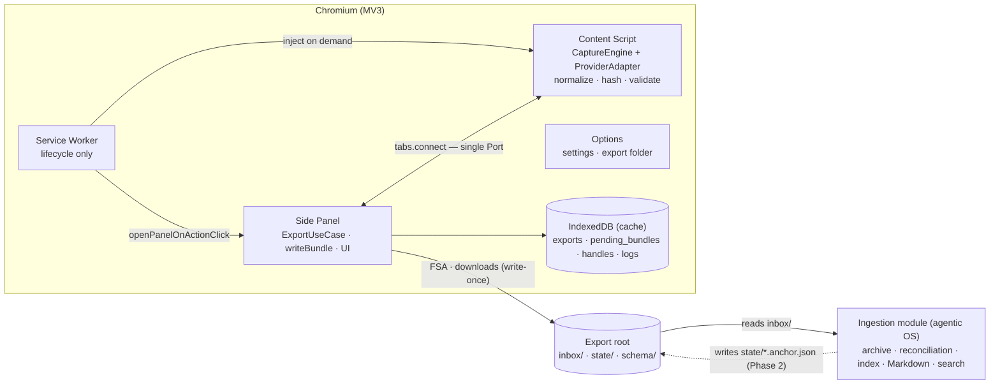

# Software Specification: Mycelium Chat Clipper (TypeScript 5 (strict))

> Rendered from the intake interview (Phase 5). Frozen contract: diverging implementation
> updates this spec in the same PR or adds an ADR superseding the relevant section.

## 1. Objective & Business Context

Knowledge workers hold long, valuable conversations with ChatGPT, Claude and Gemini that stay
locked in each provider's web UI: no complete local copy, no provider-independent format, and
no safe hand-off to the owner's own tooling. Mycelium Chat Clipper is a Chromium Manifest V3
extension (Chrome/Edge >= 120) that captures the conversation open in the active tab from the
page DOM — all of it, including virtualized history and collapsed content — normalizes it into
a provider-independent canonical JSON, and writes a self-contained, write-once export bundle
(raw.json, capture.json, manifest.json) into an inbox folder that an external ingestion module
(the owner's agentic OS) consumes. It is local-first: zero network, zero telemetry, zero private
provider endpoints, zero budget (OSS toolchain, GitHub Actions, GitHub Releases).

The extension is an exporter, not an archive (spec Rev 3.0, ADR-021): it does not keep the
archive, reconcile captures, index, chunk, search, or produce Markdown. Those live in the
ingestion module. Provider knowledge (selectors, roles, blocks) lives only in the extension;
the ingestion module consumes only the canonical contract. The export contract (spec §6) is
the product: any change to fields, file names, layout, or completion semantics requires an
ADR and a schema_version bump.

## 2. Functional Requirements

- FR-001 [Must, WP-03] Detect whether the active tab holds a supported conversation: provider, platform, title, provider_conversation_id, and the provider's project name when the UI exposes it.
- FR-002 [Must, WP-03] Load the whole history by controlled scrolling until stability, with configurable timeouts and limits.
- FR-003 [Must, WP-03/05] Accumulate messages DURING scrolling and merge windows (virtualized lists); an unresolved discontinuity yields the `gap_detected` warning and `capture_status: incomplete`.
- FR-004 [Must, WP-03] Expand collapsed content in every window BEFORE collecting it; a failed expansion marks the message `expand_failed`.
- FR-005 [Must, WP-03] Normalize into typed blocks (text, code, image, file, tool_call, thinking, unknown) with role, model and timestamp when exposed (never invented), citations, and attachment metadata.
- FR-006 [Must, WP-01/04] Semantic `content_sha256` per message and per conversation; byte hashes of raw.json and capture.json in manifest.json.
- FR-007 [Must, WP-01] ULID `capture_id` per bundle and ULID `id` per message (identity WITHIN the capture); `provider_message_id` preserved.
- FR-008 [Must, WP-03/04] Validate (schema + invariants) before writing capture.json; a violation leaves the bundle incomplete (no manifest), raw.json still written, and an error shown to the user.
- FR-009 [Must, WP-04] Write the bundle in the order raw.json, capture.json, manifest.json; the manifest is written only after the VERIFIED completion of the previous files.
- FR-010 [Must, WP-02/04] Selectable sink: a folder via the File System Access API (with read-back verification) or the downloads API; both write new files only.
- FR-011 [Should, WP-04] User annotations in the Side Panel (project, tags, note) stored as `user_annotations`; the project is remembered per conversation and proposed at the next export.
- FR-012 [Must, WP-03/04] Final report: counts per role, blocks, expansions, warnings, bundle path, and the read-back verification result.
- FR-013 [Must, WP-03/04] Cancel an in-progress capture without leaving partial bundles marked complete.
- FR-014 [Must, WP-03] Adapter `probe()`: missing essential selectors yield `Broken` (export blocked); missing non-essential ones yield `Degraded` (warning, `incomplete`).
- FR-015 [Should, WP-05] A failed write parks the bundle in IndexedDB; Retry write rewrites the SAME bundle (same capture_id) into the same folder with identical bytes.
- FR-016 [Should, WP-08] Exportable diagnostic bundle containing no message content and no titles.
- FR-017 [Must, WP-04] Export-root initialization: schema/ with the JSON Schemas, README.md, export-root.json (layout version); a higher layout version is refused.
- FR-018 [Should, WP-08] Extension UI in Italian and English.
- FR-019 [Must, WP-03] URL sanitization (provider media hosts reduced to origin + pathname) in both the canonical and the raw file.
- FR-020 [Should, WP-04] Local cache keyed by (platform, conversation_key): last capture_id, date, message count, annotations; NEVER used to decide what to export.
- FR-021 [Could, WP-09, Phase 2] When `state/<platform>/<conversation_key>.anchor.json` exists and the sink can read it, show the archive state and offer Export tail (`scan_scope: 'tail'`).

## 3. Non-Functional Requirements

<!-- Scalability / load budgets belong here as NUMBERS, not adjectives (the design "scalability"
     fold): a value per hard NFR axis — throughput / concurrency, p99 latency, memory ceiling,
     target FPS, cold-start budget — each phrased so CI could prove a violation. -->
- NFR-001 600 already-loaded messages captured in <= 20 s excluding provider-imposed waits; normalization + hashing <= 5 ms per message (median). CI: perf test on the synthetic fixture (roadmap 6.1).
- NFR-002 No task > 50 ms on the page UI thread (chunking + cooperative yield). CI: long-task measurement in the perf test.
- NFR-003 Additional tab memory <= 200 MB per 1,000 messages. CI: heap measurement in the perf test.
- NFR-004 A bundle is never marked complete unless every file was written and (with FSA) verified by read-back; with downloads each file's completion is awaited via downloads.onChanged before the next. CI: e2e scenarios 'write fails before the manifest' and 'downloads sink ordering'.
- NFR-005 Determinism: the same conversation with the same adapter yields the same content_sha256 values. CI: property-based tests (fast-check).
- NFR-006 Zero network, permanently: CSP connect-src 'none'; static scan of the production bundle, content script included, finds no fetch / XMLHttpRequest / WebSocket / sendBeacon / EventSource. CI: no-network-check.
- NFR-007 Minimal permissions (storage, unlimitedStorage, sidePanel, downloads, scripting, activeTab; host permissions for the three providers only); no MAIN-world injection; no remote code. CI: manifest snapshot test; PO approval for any change.
- NFR-008 Logs carry no message content and no titles (LogSafeValue). CI: type-level guard + unit test.
- NFR-009 A provider DOM change touches one package and recovery takes <= 1 person-day. MANUAL GATE: process metric tracked via the runbook, not CI-provable.
- NFR-010 Coverage: core >= 90% with canon, hash, slug, path and sanitizeUrl at 100%; adapters >= 80%. CI: Vitest coverage thresholds per package.
- NFR-011 Layer boundaries (spec §5.1 matrix) enforced by lint. CI: eslint-plugin-boundaries.
- NFR-012 The core package compiles and passes its tests in Node (reuse by the ingestion module or a CLI). CI: core tests run in the Node matrix with linkedom.
- NFR-013 Chrome/Edge >= 120; when the Side Panel API is unavailable the panel opens as a tab. MANUAL GATE: release smoke.
- NFR-014 Every error has a localized message and a remedy. CI: table-driven test over the error taxonomy (spec §12) and both locales.
- NFR-015 Keyboard operability, ARIA roles, AA contrast in the extension UI. CI: axe-core scan inside the Playwright e2e (dependency approved by the PO on 2026-09-11 as an addition to spec §14.4); blocking from the release milestone.
- NFR-016 SemVer schema_version in every file; additive-only contract changes within a major. CI: contract tests over the Appendix A examples plus validate-bundle.
- NFR-017 Content script <= 300 kB minified. CI: size-limit.
- NFR-018 The ingestion module can validate any bundle with the published JSON Schemas and tools/validate-bundle alone (no dependency on the extension). CI: validate-bundle runs from a clean Node install.
- CON-001 MV3: the service worker has no DOM, so parsing runs in the content script (never in the service worker).
- CON-002 Filesystem access only via FSA (user consent), downloads (under Downloads/), or Native Messaging (Phase 3).
- CON-003 Zero budget: OSS toolchain, GitHub Actions, GitHub Releases + 'Load unpacked'; Edge Add-ons when mature; Chrome Web Store deferred (ADR-013).
- CON-004 Exactly the eight mandatory design patterns (spec §5.7); any other pattern requires an ADR. Anti-patterns forbidden: God object, magic strings, browser APIs outside infrastructure/entrypoints, `any`, Singleton, logic in the UI, timers without AbortSignal.
- CON-005 No provider-internal endpoints: DOM extraction only (ADR-006).
- CON-006 Windows filesystem rules: reserved characters and names, no trailing dot or space, relative bundle path budget <= 120 characters (max combination is 113). CI: property tests on path sanitization.
- CON-007 One maintainer assisted by an AI coding agent: reduced perimeter, eight patterns, executable documentation.
- CON-008 The ingestion module is external with an unknown stack: the contract MUST be consumable from any language (JSON + JSON Schema draft 2020-12).

## 4. Logical Architecture & Core Algorithm

<!-- For a non-obvious core algorithm, include a short LANGUAGE-FREE pseudocode sketch (control
     flow + invariants) alongside the prose + diagram (the design "pseudocode" fold); skip it when
     the approach is standard. If the design owns persistent state, capture the data model here —
     entities, relations, normal form, migration policy — within ADR-0004's secondary-SQL frame. -->
**Style: Hexagonal (Ports & Adapters)** with lint-enforced boundaries (ADR-003). The domain
package never imports `chrome`, `browser`, `window`, `document`, or the extension framework;
DOM parsing goes through the `HtmlParser` port (browser `DOMParser`, Node `linkedom`), and
`Clock`, `IdGenerator`, `Hasher` are injected. Four pnpm workspace packages under the
`@mycelium-labs` scope (names fixed by the design RFC; the draft spec calls them `@lce/*`):

| Package | Role |
|---|---|
| `core` | Domain: Zod schemas (capture, raw, manifest, anchor), normalizer, canon/hash, sanitizeUrl, path, deterministic serialize, invariants, Result/errors — zero browser APIs, runs in Node |
| `adapters` | `CaptureEngine` + one `ProviderAdapter` per platform (chatgpt/, claude/, gemini/: selectors.ts, adapter.ts) — DOM to RawMessage[] |
| `extension` | WXT app: entrypoints/ (background, content, sidepanel, options), app/ (use-cases, ports), infrastructure/ (sinks, indexeddb, page-gateway, settings, logger), ui/ (Preact + signals), public/_locales/{en,it} |
| `tools` | validate-bundle (Node, no extension deps), no-network-check, schema-gen, fixture-anonymizer, perf-fixture-gen |

Layer dependency matrix (spec §5.1): domain depends on nothing; application on domain (+ ports);
adapters on domain; infrastructure on domain, application, adapters; ui on application and
domain types only. One composition root per MV3 context (`content/main.ts`, `sidepanel/main.ts`,
`options/main.ts`, `background/main.ts`); manual dependency injection, no bus.

**MV3 contexts.** Content script (isolated world): detection; `CaptureEngine` (scroll,
per-window expansion, collection, overlap merge); normalization, hashing, validation; chunked
streaming over the Port. Side Panel (application host): use cases, bundle assembly, sink writes,
local cache, UI and report. Options: settings, FSA folder picker (user gesture), export-root
initialization. Service worker: lifecycle only (open panel on action click, on-demand injection,
badge) — no domain logic, no normalization (it has no `DOMParser`, CON-001). IndexedDB holds
only non-authoritative state (`exports` cache, `pending_bundles`, `logs`) plus the FSA `handles`;
`storage.local` holds Zod-validated settings.

**Core algorithm — `CaptureEngine.runCapture` (spec §7.3).** Repeat per scroll window:
EXPAND every collapsed element currently mounted (with retries; a failure marks
`collapsed_unresolved` + `expand_failed`) → WAIT for DOM quiescence (`quietMs`, capped) →
COLLECT the mounted messages in DOM order → MERGE into the accumulated sequence by overlap
(`provider_message_id` or `dom_text_sha256` + relative position; the latest observation wins;
`expanded` replaces `collapsed_unresolved`; no overlap and not adjacent to an end → `gaps++`,
`gap_detected`, scroll step halved). Scroll upward until the top is stable for `stablePasses`
passes (or, in `tail` scope, until >= `anchorMin` anchor messages appear in order), then sweep
downward passing every window again, then a final pass. Guards: `AbortSignal` → Cancelled;
`maxPasses` / `maxDurationMs` → HistoryLoadTimeout. `capture_status` is `complete` only when
`gaps == 0`. Only scrolling and expansion are ever performed on the page (no regenerate, delete,
or branch change); an in-page shadow-DOM banner offers Cancel.

**Export session FSM (spec §5.5).** Idle → Detecting → LoadingHistory → Extracting →
Normalizing → Validating → Writing → Completed; Detecting/LoadingHistory/Validating → Failed;
Writing → PendingWrite → Writing (retry); LoadingHistory/Extracting/Normalizing → Cancelled.
A declared transition table; `transition(from, to)` throws `IllegalStateTransitionError`.

**Write sequence (spec §9.2, FR-009).** connect + verify `export-root.json` and `schema/` →
write `raw.json` (FSA: read back, compare sha256) → set `provenance.raw_file` → write
`capture.json` (FSA: read back) → write `manifest.json` LAST (its presence = complete). Any
failure parks the serialized bundle in `pending_bundles`; Retry write resumes from the failed
step with byte-identical output (deterministic serialization: schema key order, indent 0,
trailing newline, UTF-8 without BOM). With downloads, each file waits for `downloads.onChanged`
→ `complete` and `write_verified` is false.

**Three hashes, three questions (spec §8.3).** `content_sha256` (semantic: role + block types +
canonicalized primary text; excludes ids, timestamps, model, citations, attachments — "did the
content change?"); `manifest.files[].sha256` (bytes written — "is the file intact?");
`match_hints.dom_text_sha256` (cleaned DOM text, normalizer-independent — "same DOM fragment
across captures?"). Never mixed.

**Data & schema.** No database: the store is the export folder (write-once files) plus the
non-authoritative IndexedDB cache (`exports`, `pending_bundles`, `handles`, `logs`, version 1).
Losing the cache must be harmless (P1, ADR-023). The Zod definitions in the core package are
the single source of truth; JSON Schema is generated, never hand-edited (ADR-004).

## 5. Public Interface

<!-- The API contract (the design "api" fold): each operation with its payload shapes, the error
     model (the failure taxonomy, not just the happy path), and the versioning / SemVer surface.
     A service/web project may keep the written-out contract under docs/api/ (capabilities.api_spec). -->
Consumers import via `import { CanonicalCapture, normalize, validateInvariants } from '@mycelium-labs/chatclipper-core';`. The public surface:

- Export bundle layout v1 (`export_layout_version: 1`): `inbox/<platform>/<conversation_key>/<capture_id>/{raw.json, capture.json, manifest.json}` plus `export-root.json`, `schema/*.v1.json` and `README.md` at the export root; `state/<platform>/<conversation_key>.anchor.json` is written by the consumer (Phase 2). `conversation_key` = sanitized provider id (ASCII [a-z0-9-_], <= 64) or `nokey`; `capture_id` = ULID. The extension never modifies, deletes, or reads anything under `inbox/`.
- `capture.json` — CanonicalCapture 1.0.0: `capture` (capture_id, captured_at, scan_scope, anchor, previous_capture_id, capture_status, warnings), `conversation` (provider, platform, provider_conversation_id, provider_project_name, title, source_url, created_at/updated_at, language, models, message_count, content_sha256, branch_info), `user_annotations` (project, tags, note), `messages[]` (ULID id, contiguous ordinal, provider_message_id, role, author_name, model, created_at, content blocks, citations, attachment_ids, content_sha256, match_hints.dom_text_sha256, metadata), `attachments[]`, `provenance` (extension/core versions, adapter + selectors_version, capture_method 'dom', browser, raw_file hash). Missing value = null; timestamps only from unambiguous values.
- Content blocks (discriminated union on `type`): text {markdown}; code {language, code, filename}; image {alt, attachment_id, source_url}; file {name, attachment_id, source_url}; tool_call {tool_name, status, input_markdown, output_markdown}; thinking {markdown, summarized}; unknown {markdown, reason}. Consumers treat unknown block types as `unknown`.
- `raw.json` — RawCapture 1.0.0: per message seq, provider_message_id, role_hint, `outer_html` (after strip selectors and URL sanitization, otherwise verbatim), dom_text_sha256, expansion_state, model/timestamp/branch hints; plus page, adapter and stats (passes, duration_ms, expanded, expand_failed, gaps, url_redactions). `outer_html` is UNTRUSTED: consumers must not render or parse it for content.
- `manifest.json` — Manifest 1.0.0: capture_id, platform, conversation_key, provider_conversation_id, captured_at, completed_at, `files[] {name, sha256, bytes}`, schema_versions, producer {name, version}, write_verified. Its presence means the bundle is complete; consumers verify the hashes before ingesting and treat `capture_id` as the idempotency key.
- `anchor.json` — Anchor 1.0.0 (Phase 2, contract fixed now): platform, provider_conversation_id, archive_conversation_id, archived_message_count, last_ingested_capture_id, written_at, 3 to 10 `anchor_messages` (provider_message_id, dom_text_sha256, content_sha256, role). Read-only for the extension, <= 256 kB, <= 90 days old, treated as hostile (Zod; invalid → `anchor_invalid` warning + full scan).
- Invariants (`validateInvariants(capture): Violation[]`): contiguous ordinals from 0; unique ids and unique non-null provider_message_ids; attachment_ids resolve; message_count equals messages.length; conversation and message content_sha256 match recomputation; every message has >= 1 block; `tail` scope implies a non-null anchor; `provenance.raw_file` set when raw.json was written.
- Core library (Node-capable): `normalize(raw, ctx): Result<CanonicalDraft>`, `canon`, `Hasher`, `sanitizeUrl`, `sanitizePathSegment` / `buildBundlePath`, deterministic `serialize`, `validateInvariants`, `Result` / `DomainError`, branded ids, and the ports `Clock`, `IdGenerator`, `Hasher`, `HtmlParser`.
- Adapter contract: `ProviderAdapter` (id, provider, version, selectorsVersion, mediaHostPatterns, matches, detect, probe → healthy|degraded|broken, getScrollContainer, getMessageContainer, collectVisibleMessages, isHistoryLoading, findCollapsed, expand, extractPageMetadata) and `runCapture(adapter, doc, {scanScope, anchor, options}, {onProgress, onChunk}, signal): Promise<Result<RawCapture>>`.
- `ExportSink` port: kind fsa|downloads|memory; capabilities {canRead, canVerify}; connect(), writeFile(relPath, bytes) (fails if the file exists with different bytes), readFile, exists. Retry policy `withRetry(fn)`: 3 attempts, backoff 200/800/2000 ms on transient errors.
- CLI `validate-bundle <dir>` (Node, zero extension dependencies): validates the three files against the published schemas and checks the manifest hashes; ships with every release together with `schema/`.
- Side Panel ↔ content script Port protocol v1 over `tabs.connect(tabId, {name})`: SP→CS `detect`, `capture.start {session_id, scan_scope, options, anchor}`, `capture.cancel`; CS→SP `detect.result`, `capture.progress`, `capture.chunk` (<= 50 messages or 512 kB, monotonic seq), `capture.complete`, `capture.error`. Every message `{protocol_version: 1, type, payload}` is Zod-validated on both sides.
- Error model — coded errors, each with a localized message and remedy (spec §12): AdapterNotFound, ConversationNotDetected, AdapterBroken, AdapterDegraded, ContentScriptUnavailable, ContentScriptDisconnected, HistoryLoadTimeout, ValidationFailed, ExportRootNotConnected, PermissionDenied, ExportRootLayoutAhead, WriteFailed, WriteVerificationFailed, DownloadInterrupted, IllegalStateTransition, Cancelled. Coded warnings (spec §8.4): gap_detected, adapter_degraded, expand_failed, timestamp_relative_ignored, math_rendered_only, empty_message, unknown_block, branch_detected, truncated_by_provider, url_query_stripped, conversation_key_missing, anchor_not_found, anchor_invalid, write_not_verified.
- Versioning (spec §6.7): SemVer `schema_version` in every file. Within a major only optional/nullable fields and documented enum values are added; consumers tolerate unknown fields and unknown enum values. A new major lands as `schema/*.v2.json` and consumers refuse unknown majors. A MAJOR bump = any removal, rename, type change, or change to file names, folder layout, or completion semantics.

## 6. Verification & Test Strategy

**Test pyramid (spec §13.1).** Unit (Vitest) over the core package — schema, canon/hash,
normalizer with linkedom, sanitizeUrl, path, invariants, deterministic serialization — and over
the application layer with fake ports. Property-based (fast-check): `canon` idempotent; hashes
deterministic and field-order independent; path sanitization never emits forbidden characters,
never empty, idempotent; window merge reconstructs the sequence from overlapping windows in mixed
order; deterministic serialization (same object ⇒ same bytes); (Phase 2) anchor matching tolerant
of a regenerated last message. Contract (Ajv + generated JSON Schema): the Appendix A example
bundles validate, negatives are rejected, `validate-bundle` is green on golden bundles and red on
an altered hash. Golden (Vitest snapshots under review): `capture.json` and `manifest.json` for
known fixtures. Adapter DOM contract (Vitest + happy-dom): per fixture, counts per role, ids, code
blocks, expanded elements, sanitized URLs. E2E (Playwright with `--load-extension`) against a
synthetic provider that exercises lazy loading, virtualization (40 mounted), "Show more" inside
unmounted messages, and a branch navigator: full export, cancel, retry write, `memory` and
`downloads` sinks; (Phase 2) tail export with an anchor. The FSA picker cannot be automated:
`FsaExportSink` is covered by unit tests with fake handles plus the manual smoke.

**Test naming and traceability.** Every test name carries the requirement id it proves
(`should write manifest last [FR-009]`); Appendix B Gherkin scenarios are the acceptance
criteria for FR-002/003/004/009/014/019/020/021 and NFR-004/005/006.

**Performance (spec §13.2).** Synthetic 1,000-message fixture measuring NFR-001/002/003;
`size-limit` on the content script (NFR-017). Warnings in Phase 1, blocking gates from Phase 2
(roadmap 6.1). Results are recorded under `docs/benchmarks/`.

**Fixtures (spec §13.3).** `fixtures/<platform>/<selectors_version>/<name>.html` +
`.fixture.json` + README, recorded with the dev-only Record fixture flow after anonymization
(same-length text replacement, URL replacement, `data-*` ids kept). Three per provider: short;
with code/tables/images; long with collapsed content. Never real content in the repo; never a
live provider in CI (ADR-017). Missing fixture → implement from Appendix C hints, tag tests
`@fixture-pending`, add a `docs/TODO-HUMAN.md` entry.

**CI gate order (spec §13.4).** lint (boundaries) → format:check → typecheck → test:unit
(coverage thresholds) → test:contract → build → test:e2e → size-limit → no-network-check →
audit. Dependabot weekly; CodeQL. `pnpm check` runs the local subset before every commit; a
red gate is never committed and never weakened (coverage, lint, CSP, invariants, contract).

**Explicit manual gates.** Release smoke (`docs/runbooks/release-smoke.md`): one real
conversation per provider, real FSA folder, `validate-bundle` on the result (NFR-013 fallback
included). NFR-009 recovery time is a process metric tracked via the "provider changed its DOM"
runbook. Accessibility (NFR-015) is scanned with axe-core inside the Playwright e2e (an approved
addition to spec §14.4), blocking from the release milestone.
Any change to `permissions`, `host_permissions`, or CSP requires Product Owner approval.

**Release (spec §13.5).** SemVer; Keep a Changelog; tag → zip, `SHA256SUMS`, CycloneDX SBOM,
with `schema/` and `validate-bundle` attached for the ingestion module. GitHub Releases; Edge
Add-ons when mature. Definition of Done per work package (spec §14.3): acceptance criteria
traced in tests; `pnpm check` and CI green; documentation updated (ARCHITECTURE, ADRs,
CHANGELOG, CONTRACT when §6 is touched); no `TODO` without a reference; extension loadable;
manual smoke where indicated.

Toolchain: built with WXT (Vite) for the extension; tsc --build for the core, adapters and tools packages, tested with Vitest (unit, golden snapshots), fast-check (property-based), happy-dom (adapter DOM contract), Ajv (JSON Schema contract), Playwright (e2e against a synthetic provider) with axe-core (accessibility scan; approved by the PO on 2026-09-11 as an addition to spec §14.4), checked with
tsc --strict (type soundness); eslint --max-warnings 0; no-network-check (static scan of the production bundle, content script included); size-limit (content script <= 300 kB); pnpm audit; CodeQL, coverage target ≥ 80% line. Every functional and
non-functional requirement above maps to a CI gate (see [`.github/workflows/ci.yml`](../../.github/workflows/ci.yml)).
